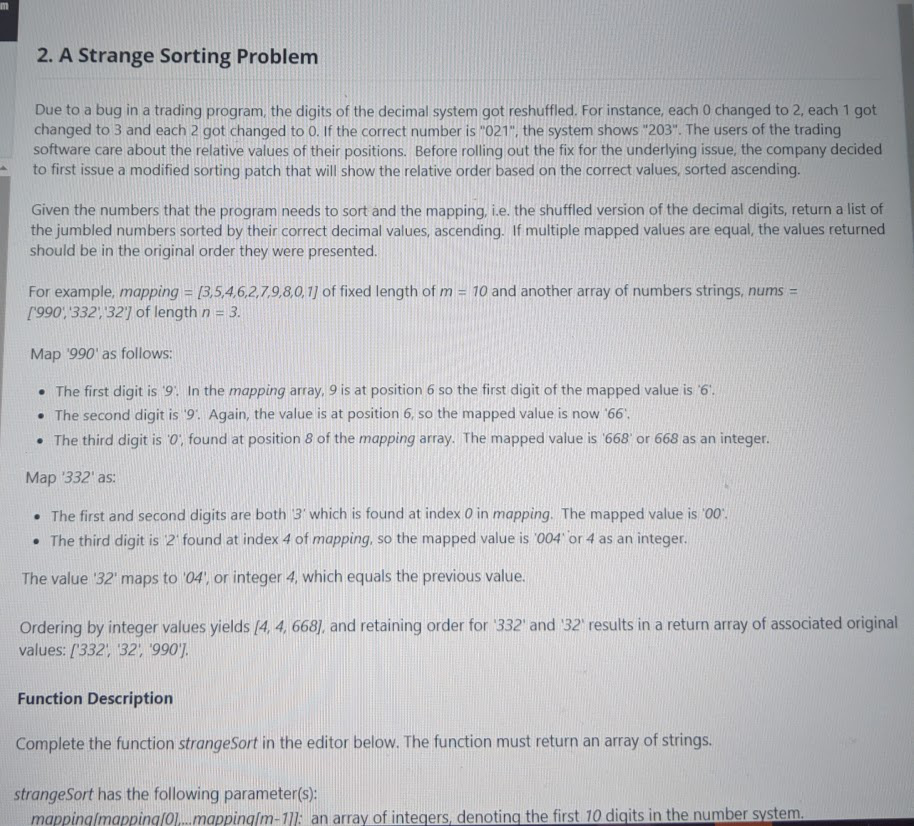
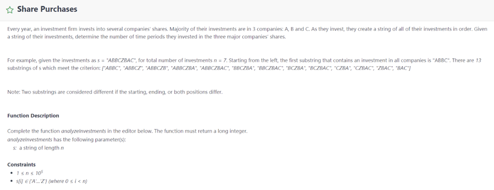
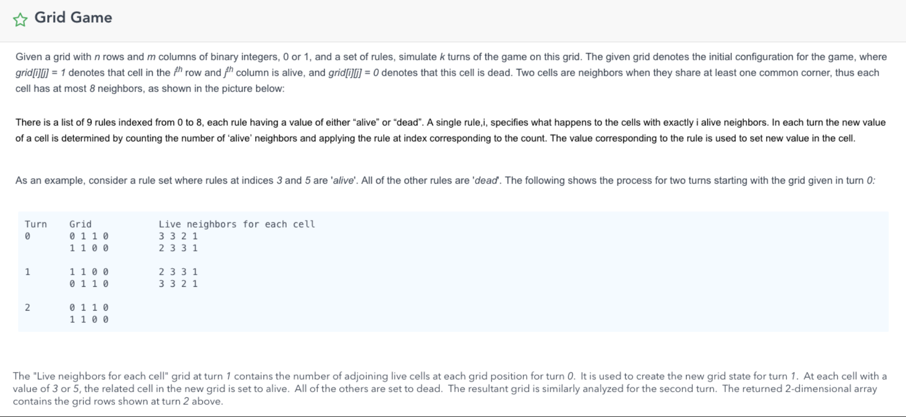
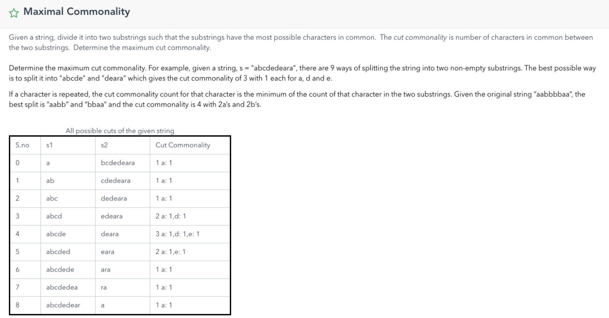

# Goldman Sachs OA
- [Goldman Sachs OA](#goldman-sachs-oa)
    - [strange sort](#strange-sort)
    - [share purchase](#share-purchase)
    - [grid game](#grid-game)
    - [maximal commonality](#maximal-commonality)
    - [rotate string](#rotate-string)
    - [](#)

### strange sort

```python
def strangeSort(mapping, nums):
    map = dict()
    for i, n in enumerate(mapping):
        map[str(n)] = str(i)

    # get original number
    def func(num):
        s = ''
        for c in num:
            s += map[c]
        return int(s)

    # stable sort
    return sorted(nums, key=func)


# nums = ['12','02','4', '023', '65', '83', '224', '50']
# mapping = [2,1,4,8,6,3,0,9,7,5]
m = [3, 5, 4, 6, 2, 7, 9, 8, 0, 1]
n = ['990', '332', '32']
print(strangeSort(m, n))
```

### share purchase

Similar to [76 MinWindowSubstring](../files/76.md).<br> 
Link: [here](https://leetcode.com/discuss/interview-question/365452/goldman-sachs-oa-2020-shares-purchase),
we could use `sliding window` with 2 pointers. i at the start, j at start + 1 and less than end. Once you have all companies present, we just add `length-j` to the result. Then start again with i+=1 until i reaches end-3where no more possibility of containing the three companies
```python
def sharePurchase(s):
    map = {'A':1, 'B':1, 'C':1}
    res = 0
    start = 0
    match = 0
    for j in range(len(s)):
        if s[j] in map:
            map[s[j]] -= 1
            if map[s[j]] >= 0:
                match += 1

        while match == 3:
            # difference to 76
            res += len(s) - j

            if s[start] in map:
                map[s[start]] += 1
                if map[s[start]] > 0:
                    match -= 1

            start += 1

    return res
```

### grid game

similar to [289 GameOfLife](../files/289.md)
```python
def gridGame(grid, k, rules):
    m, n = len(grid), len(grid[0])
    for i in range(k):
        grid = applyRule(grid, m, n, rules)

    return grid

def applyRule(grid, m, n, rules):
    newGrid = [[0] * n for _ in range(m)]

    for i in range(m):
        for j in range(n):
            if countOnes(grid, m, n, i, j) in rules:
                newGrid[i][j] = 1

    return newGrid

def countOnes(grid, m, n, i, j):
    num = 0

    for x in range(max(0, i - 1), min(i + 1, m - 1) + 1):
        for y in range(max(0, j - 1), min(j + 1, n - 1) + 1):
            if grid[x][y] == 1:
                num += 1

    return num - (grid[i][j] == 1)
```
```python
def gridGame2(grid, k, rules):
    m, n = len(grid), len(grid[0])
    for _ in range(k):
        countBoard = [[0]*n for _ in range(m)]
        for i in range(m):
            for j in range(n):
                if grid[i][j] == 0:
                    continue
                for x in range(max(0, i-1), min(i+1, m-1)+1):
                    for y in range(max(0, j-1), min(j+1, n-1)+1):
                        countBoard[x][y] += 1

                countBoard[i][j] -= 1

        for i in range(m):
            for j in range(n):
                if countBoard[i][j] in rules:
                    grid[i][j] = 1
                else:
                    grid[i][j] = 0

    return grid
```
```python
def gridGame3(grid, k, rules):
    m, n = len(grid), len(grid[0])
    for _ in range(k):
        for i in range(m):
            for j in range(n):
                lives = getLiveNbrs(grid, m, n, i, j)

                if lives in rules:
                    if grid[i][j] == 1: grid[i][j] = 3
                    else: grid[i][j] = 2

        for i in range(m):
            for j in range(n):
                grid[i][j] >>= 1

    return grid

def getLiveNbrs(grid, m, n, i, j):
    lives = 0
    for x in range(max(0, i - 1), min(i + 1, m - 1) + 1):
        for y in range(max(0, j - 1), min(j + 1, n - 1) + 1):
            lives += (grid[x][y] & 1)

    lives -= (grid[i][j] & 1)
    return lives
```
### maximal commonality

Brutal Force  O(n^2)
```python
import collections
def maxCommon(s):
    res = 0
    for i in range(1, len(s)):
        c1 = dict(collections.Counter(s[:i]))
        c2 = dict(collections.Counter(s[i:]))
        match = 0
        for c in c1:
            if c in c2:
                match += min(c1[c], c2[c])

        if match > res:
            res = match

    return res
```
```python
import collections
def maxCommon(stri):
    # right - left
    count = [0 for _ in range(26)]
    for i in stri:
        count[ord(i) - 97] += 1

    res = 0
    cur = 0
    for i in stri:
        if count[ord(i) - 97] > 1:
            cur += 1
            count[ord(i) - 97] -= 2
        elif count[ord(i) - 97] == 0:
            cur -= 1
        else:
            count[ord(i) - 97] -= 1
        res = max(cur, res)
    return res
```

### rotate string
```python
# 0 left, 1 right
# + for left, - for right, first get real rotation number
# mod len(s), then slice
def rotateString(s, directions, amounts):
    num = 0
    for i in range(len(directions)):
        if directions[i] == 0:
            num += amounts[i]
        else:
            num -= amounts[i]

    num %= len(s)
    if num > 0:
        return s[num:] + s[:num]
    else:
        return s[:num] + s[num:]

s = 'hurart'
d = [0, 0, 1, 0, 1]
a = [2, 1, 3, 1, 6]
print(rotateString(s, d, a))
```
### 