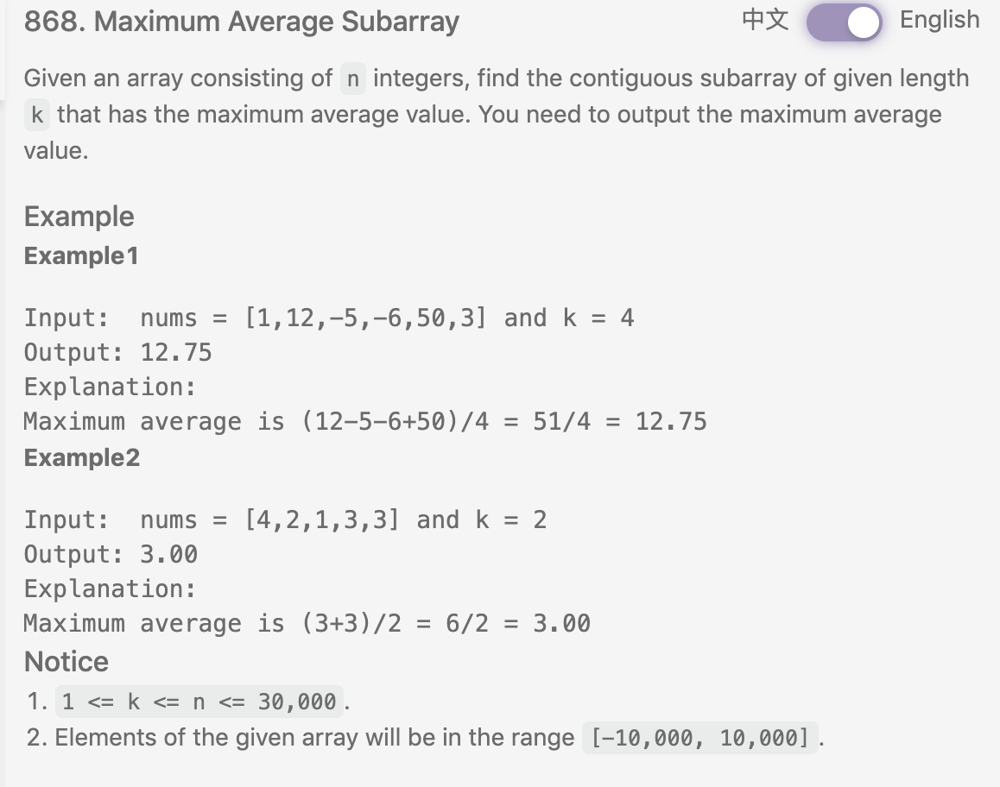
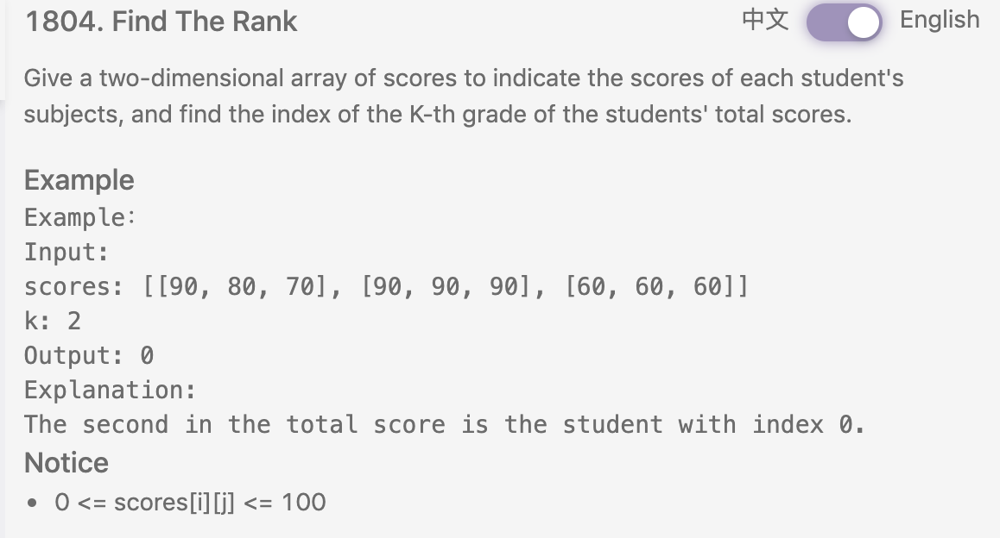
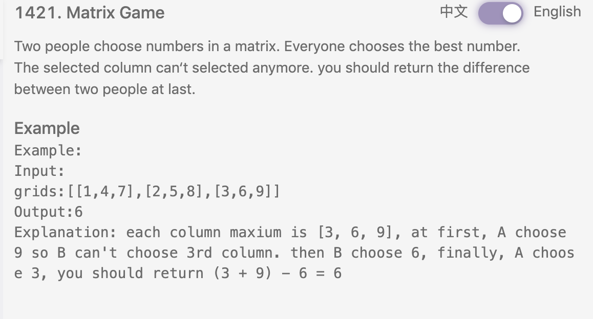

# Goldman Sachs OA
- [Goldman Sachs OA](#goldman-sachs-oa)
    - [strange sort](#strange-sort)
    - [share purchase](#share-purchase)
    - [grid game](#grid-game)
    - [maximal commonality](#maximal-commonality)
    - [rotate string](#rotate-string)
    - [maximum average subarray](#maximum-average-subarray)
    - [find the rank](#find-the-rank)
    - [matrix game](#matrix-game)
    - [spiral order prime](#spiral-order-prime)
    - [whole minute dilemma](#whole-minute-dilemma)
    - [cap lock](#cap-lock)
    - [unique substring](#unique-substring)
    - [reverse algebraic expression](#reverse-algebraic-expression)

### strange sort

```python
def strangeSort(mapping, nums):
    map = dict()
    for i, n in enumerate(mapping):
        map[float(n)] = float(i)

    # get original number
    def func(num):
        s = ''
        for c in num:
            s += map[c]
        return float(s)

    # stable sort
    return sorted(nums, key=func)


# nums = ['12','02','4', '023', '65', '83', '224', '50']
# mapping = [2,1,4,8,6,3,0,9,7,5]
m = [3, 5, 4, 6, 2, 7, 9, 8, 0, 1]
n = ['990', '332', '32']
print(strangeSort(m, n))
```

### share purchase

Similar to [76 MinWindowSubstring](../files/76.md).<br> 
Link: [here](https://leetcode.com/discuss/interview-question/365452/goldman-sachs-oa-2020-shares-purchase),
we could use `sliding window` with 2 pointers. i at the start, j at start + 1 and less than end. Once you have all companies present, we just add `length-j` to the result. Then start again with i+=1 until i reaches end-3where no more possibility of containing the three companies
```python
def sharePurchase(s):
    map = {'A':1, 'B':1, 'C':1}
    res = 0
    start = 0
    match = 0
    for j in range(len(s)):
        if s[j] in map:
            map[s[j]] -= 1
            if map[s[j]] >= 0:
                match += 1

        while match == 3:
            # difference to 76
            res += len(s) - j

            if s[start] in map:
                map[s[start]] += 1
                if map[s[start]] > 0:
                    match -= 1

            start += 1

    return res
```

### grid game

similar to [289 GameOfLife](../files/289.md)
```python
def gridGame(grid, k, rules):
    m, n = len(grid), len(grid[0])
    for i in range(k):
        grid = applyRule(grid, m, n, rules)

    return grid

def applyRule(grid, m, n, rules):
    newGrid = [[0] * n for _ in range(m)]

    for i in range(m):
        for j in range(n):
            if countOnes(grid, m, n, i, j) in rules:
                newGrid[i][j] = 1

    return newGrid

def countOnes(grid, m, n, i, j):
    num = 0

    for x in range(max(0, i - 1), min(i + 1, m - 1) + 1):
        for y in range(max(0, j - 1), min(j + 1, n - 1) + 1):
            if grid[x][y] == 1:
                num += 1

    return num - (grid[i][j] == 1)
```
```python
def gridGame2(grid, k, rules):
    m, n = len(grid), len(grid[0])
    for _ in range(k):
        countBoard = [[0]*n for _ in range(m)]
        for i in range(m):
            for j in range(n):
                if grid[i][j] == 0:
                    continue
                for x in range(max(0, i-1), min(i+1, m-1)+1):
                    for y in range(max(0, j-1), min(j+1, n-1)+1):
                        countBoard[x][y] += 1

                countBoard[i][j] -= 1

        for i in range(m):
            for j in range(n):
                if countBoard[i][j] in rules:
                    grid[i][j] = 1
                else:
                    grid[i][j] = 0

    return grid
```
```python
def gridGame3(grid, k, rules):
    m, n = len(grid), len(grid[0])
    for _ in range(k):
        for i in range(m):
            for j in range(n):
                lives = getLiveNbrs(grid, m, n, i, j)

                if lives in rules:
                    if grid[i][j] == 1: grid[i][j] = 3
                    else: grid[i][j] = 2

        for i in range(m):
            for j in range(n):
                grid[i][j] >>= 1

    return grid

def getLiveNbrs(grid, m, n, i, j):
    lives = 0
    for x in range(max(0, i - 1), min(i + 1, m - 1) + 1):
        for y in range(max(0, j - 1), min(j + 1, n - 1) + 1):
            lives += (grid[x][y] & 1)

    lives -= (grid[i][j] & 1)
    return lives
```
### maximal commonality

Brutal Force  O(n^2)
```python
import collections
def maxCommon(s):
    res = 0
    for i in range(1, len(s)):
        c1 = dict(collections.Counter(s[:i]))
        c2 = dict(collections.Counter(s[i:]))
        match = 0
        for c in c1:
            if c in c2:
                match += min(c1[c], c2[c])

        if match > res:
            res = match

    return res
```
```python
import collections
def maxCommon(stri):
    # right - left
    count = [0 for _ in range(26)]
    for i in stri:
        count[ord(i) - 97] += 1

    res = 0
    cur = 0
    for i in stri:
        if count[ord(i) - 97] > 1:
            cur += 1
            count[ord(i) - 97] -= 2
        elif count[ord(i) - 97] == 0:
            cur -= 1
        else:
            count[ord(i) - 97] -= 1
        res = max(cur, res)
    return res
```

### rotate string
```python
# 0 left, 1 right
# + for left, - for right, first get real rotation number
# mod len(s), then slice
def rotateString(s, directions, amounts):
    num = 0
    for i in range(len(directions)):
        if directions[i] == 0:
            num += amounts[i]
        else:
            num -= amounts[i]

    num %= len(s)
    if num > 0:
        return s[num:] + s[:num]
    else:
        return s[:num] + s[num:]

s = 'hurart'
d = [0, 0, 1, 0, 1]
a = [2, 1, 3, 1, 6]
print(rotateString(s, d, a))
```
### maximum average subarray

```python
class Solution:
    """
    @param nums: an array
    @param k: an integer
    @return: the maximum average value
    """
    def findMaxAverage(self, nums, k):
        # Write your code here
        cur = 0
        for i in range(k):
            cur += nums[i]
        res = cur
        
        for i in range(k, len(nums)):
            cur += nums[i] - nums[i - k]
            res = max(res, cur)
        
        return res / k
```

### find the rank

```python
def FindTheRank(scores, K):
    # write your code here
    sortedScores = sorted(scores, key=lambda x: sum(x), reverse=True)
    target = sortedScores[K - 1]
    
    for i in range(len(scores)):
        if scores[i] == target:
            return i
```
```python
def FindTheRank(scores, K):
        # write your code here
        return sorted([[sum(score), i] for i, score in enumerate(scores)], reverse = True)[K - 1][1]
```
Find Kth largest element, use score sum to heapify score index.
```python
import heapq
def findRank(scores, K):
    h = []
    for i in range(K):
        h.append((sum(scores[i]), i))
    heapq.heapify(h)

    for i in range(K, len(scores)):
        add = sum(scores[i])
        if add > h[0][0]:
            heapq.heappop(h)
            heapq.heappush(h, (add, i))

    return heapq.heappop(h)[1]
```

### matrix game

```python
def MatrixGame(grids):
    if not grids or not grids[0]: return 0
    
    colMax = []
    m, n = len(grids), len(grids[0])
    for j in range(n):
        maxVal = grids[0][j]
        for i in range(1, m):
            maxVal = grids[i][j] if grids[i][j] > maxVal else maxVal
        colMax.append(maxVal)
    
    list.sort(colMax, reverse=True)
    
    res = 0
    for i in range(n):
        if i % 2 == 0:
            res += colMax[i]
        else:
            res -= colMax[i]
    
    return res
```

### spiral order prime
check if prime: [1](https://blog.csdn.net/afei__/article/details/80638460), [2](https://www.jianshu.com/p/0ff11ac83cae).
```python
def spiralMatrix(grid):
    res = []
    m, n = len(grid), len(grid[0])
    primeTable = getPrimeTable(100)

    rowS, rowE, colS, colE = 0, m, 0, n
    while rowS < rowE and colS < colE:
        for j in range(colS, colE):
            res.append(grid[rowS][j])
        rowS += 1
        if colS < colE:
            for i in range(rowS, rowE):
                if primeTable[grid[i][colE-1]]:
                    res.append(grid[i][colE-1])
            colE -= 1
        if rowS < rowE:
            for j in reversed(range(colS, colE)):
                if primeTable[grid[rowE-1][j]]:
                    res.append(grid[rowE-1][j])
            rowE -= 1
        if colS < colE:
            for i in reversed(range(rowS, rowE)):
                if primeTable[grid[i][colS]]:
                    res.append(grid[i][colS])
            colS += 1

    return res

def getPrimeTable(n):
    isPrime = [True] * n
    isPrime[0] = False
    isPrime[1] = False
    for i in range(2, int(n ** 0.5)):
        if isPrime[i]:
            for j in range(2, n//i):
                isPrime[i * j] = False

    return isPrime

g = [[1, 2, 3],
     [4, 5, 6],
     [7, 8, 9],
     [10, 11, 12]]
print(spiralMatrix(g))
```

### whole minute dilemma
variant of 2 sum. Given a song, that how many time pairs' sum is multiple of 60. (note has to be pair, single 60 does not work)
```python
def wholeMinute(times):
    for time in times:
        time %= 60
    map = dict()
    res = 0
    for t in times:
        if 60 - t in map:
            res += map[60 - t]

        map[t] = map.get(t, 0) + 1

    return res

t = [20, 40, 60]#1
print(wholeMinute(t))
```

### cap lock
```python
# if meet 'a', cap lock; if meet '\', back to normal
def capLock(s):
    res = r''
    isLocked = False
    for c in s:
        if c is 'a':
            isLocked = True
            continue
        if c is '\\':
            isLocked = False
            res += c
        elif c.isalpha() and c.islower() and isLocked:
            res += c.upper()
        else:
            res += c

    return res

print(capLock("My keyboard is broken!"))
# "My keyboRD IS BROKEN!"
print(capLock(r"\"Baa, Baa!\" said the sheep"))
# "\"B, B!\" sID THE SHEEP"
```

### unique substring
```python
#given string，find all substrings of len k
# e.g.,\’ababacc’, k = 3 -> [‘aba’, ‘acc’, ‘bab’, ‘bac’]
def uniqueSubstring(s, k):
    res = []
    dfs(0, [], res, s, k)
    return res

def dfs(start, path, res, s, count):
    if count == 0:
        if path not in res:
            res.append(path)
        return

    for i in range(start, len(s) - count + 1):
        dfs(i + 1, path+[s[i]], res, s, count-1)

# print(uniqueSubstring("ababc", 3))
print(uniqueSubstring("abcbab", 2))
```

### reverse algebraic expression
```python
def reverseAlgebra(s):
    stack = []
    isNum = True
    if not s: return ""

    tmp = s[0]
    for i in range(1, len(s)):
        cur = s[i]
        if isNum and (cur.isdigit() or cur == '.'):
            tmp += cur
        elif isNum and (cur == '+' or cur == '-' or cur == '*' or cur == '/'):
            stack.append(tmp)
            tmp = cur
            isNum = False
        elif not isNum and (cur == '+' or cur == '-' or cur == '*' or cur == '/'):
            stack.append(tmp)
            tmp = cur
            isNum = True
        elif not isNum and cur.isdigit():
            stack.append(tmp)
            tmp = cur
            isNum = True

    stack.append(tmp)
    return ''.join(reversed(stack))

print(reverseAlgebra("1*2.4+9.6-23.89"))#"23.89-9.6+2.4*1"
print(reverseAlgebra("1*2.4+-9.6-23.89"))#"23.89--9.6+2.4*1"
print(reverseAlgebra("-1*2.4+-9.6-23.89"))#"23.89--9.6+2.4*-1
print(reverseAlgebra("-12*2.4+-9.6--23.89"))#-23.89--9.6+2.4*-12
print(reverseAlgebra("-1*1.2/3-44"))
```