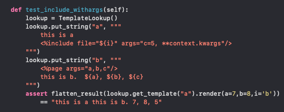

# Behavioral
There was nothing super special about this round, just your usual BQ's like:

challenge project
why leave / why join
leading + task assignment
conflict with peer/manager
It's worth prepping with the star framework in advance so you can answer the common questions better. I really like this post if anyone want to learn more about it: https://leetcode.com/discuss/post/1729926/a-guide-for-behavioral-round-by-codecosm-ga31/.

# Integration (Request replaying)
This one was pretty straight forward, just needed to implement a basic system to keep track of duplicate requests and not process them multiple times. You are expected to consolidate duplicate requests into one, and just process it once. You need to be able to parse json objects from a string and from a file and compare them to check to see if the request is a duplicate or not. It's worth practicing reading json data from files and comparing json objects for equality, but overall this was probably the easiest of all the rounds.

# Debug (Mako)
This is a pretty unique round and looking for a completely different thing than a more traditional coding round.

You get access to a codebase of a templating library, Mako, and it has a few bugs in it that you need to track down. You get to run the code locally on your ide and it's mostly about showing the interviewer how you approach debugging. The codebase was pretty big, but there's tons of unit tests you can use to help narrow down what you're looking for. I was also able to find all the starter code for this on offerretriever. The test cases look like this:


If you're like me and rely heavily on print statements to debug, I'd highly recommend taking some time to be familiar with how to use the debugger quickly in your IDE. The codebase is large and using a debugger is definitely faster than literring print statements all over code you're not familiar with.

# Coding (Email Subscriptions)
Prompt was to build a system that sends subscription-related emails to users (subscribe/expired/reminders).
You're given a schedule as input on when to send these emails, a list of user subscriptions, and need to output the sending schedule.

This question is available on some question bank sites like this.

There's a couple of followups to this and I was able to finish the first one, but ran tight on time and wasn't able to finish the second follow up. Hopefully that was good enough...

---

Part 1:
You are given a string representing application IDs in the following format:

Each application ID is prefixed by its length (number of characters in the ID).
The format is: lengthOfApplicationId + APPLICATION_ID + ... + 0 (ends with a 0).
Example:
Input: 10A13414124218B124564356434567430
Output: ["A134141242", "B12456435643456743"]

Part 2:
Filter the application IDs obtained from Part 1 to return only the "whitelisted" application IDs.

Example:
Input: 10A13414124218B124564356434567430, ["A134141242"]
Output: ["A134141242"]
```python
str = "10A13414124218B124564356434567430"

def solve(s, whitelisted):
   
   temp = ""
   num = 0
   ids = []
   i = 0
   
   while i < len(s):
       if s[i].isalpha():
           num = int(temp)
           ids.append(str[i:i+num])
           temp = ""
           i += num
       else:
           temp += s[i]
           i += 1
 
   
   for id in ids:
       if id in whitelisted:
           print(id)
   
       
solve(str, ["A134141242"])
```