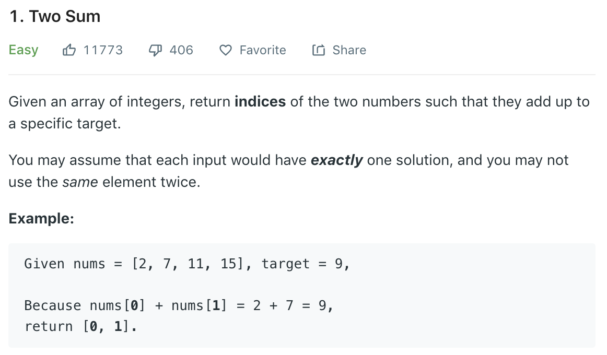

### Solution
if elements are unique
```python
class Solution(object):
    def twoSum(self, nums, target):
        sorted_nums = sorted(nums)
        i, j = 0, len(nums) - 1
        while i < j:
            val = sorted_nums[i] + sorted_nums[j]
            if val == target:
                return [nums.index(sorted_nums[i]), nums.index(sorted_nums[j])]
            if val < target:
                i += 1
            else:
                j -= 1
```
### Solution 2 Hashmap
```python
class Solution(object):
    def twoSum(self, nums, target):
        """
        :type nums: List[int]
        :type target: int
        :rtype: List[int]
        """
        seen = dict()
        for i in range(len(nums)):
            if nums[i] in seen:
                return [seen[nums[i]], i]
            seen[target - nums[i]] = i
```