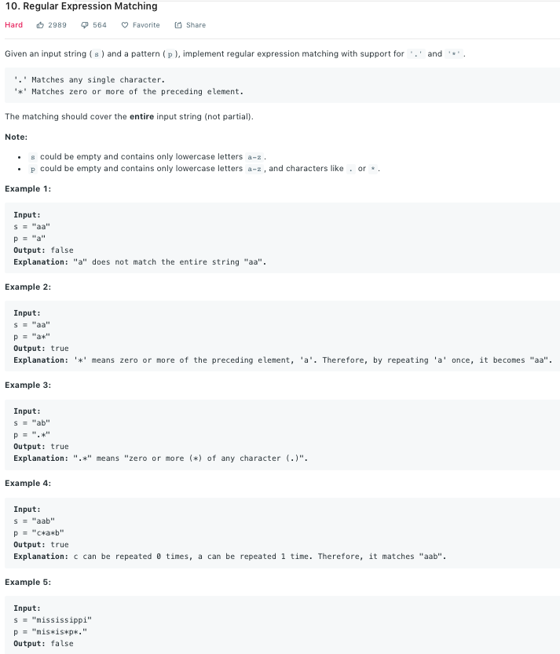

Similar to [44](44.md)
### Solution DP
```python
class Solution(object):
    def isMatch(self, str, pattern):
        """
        :type s: str
        :type p: str
        :rtype: bool
        """
        s, p = len(str), len(pattern)
        dp = [[False] * (p + 1) for _ in range(s + 1)]

        dp[0][0] = True
        for j in range(1, p + 1):
            if pattern[j - 1] == '*':
                dp[0][j] = dp[0][j - 2]
        
        for i in range(1, s + 1):
            for j in range(1, p + 1):
                if pattern[j - 1] != '*':
                    dp[i][j] = dp[i - 1][j - 1] and (pattern[j - 1] == str[i - 1] or pattern[j - 1] == '.')
                else:
                    dp[i][j] = dp[i][j - 2] or (dp[i - 1][j] and (pattern[j - 2] == str[i - 1] or pattern[j - 2] == '.'))
        
        return dp[-1][-1]
```