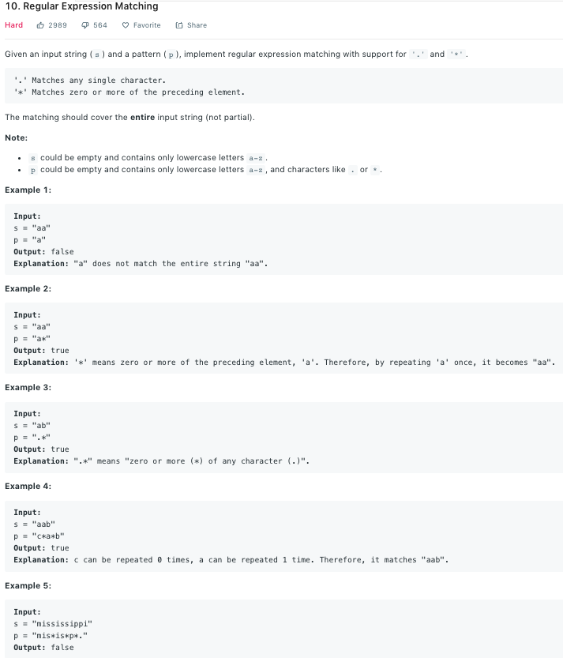

Similar to [44](44.md)
### Solution DP
`dp[i][j]`：字符串 s 的前 i 个字符(s[:i])与模式串 p 的前 j 个字符是否匹配。
转移方程：
1. 情况 A：p[j-1] 不是 *
这时逻辑很简单。只要当前字符匹配（相同或者是'.'），就取决于之前的匹配结果。
    如果 s[i-1] == p[j-1] 或 p[j-1] == '.'：`dp[i][j] = dp[i-1][j-1]` 
2. 情况 B：p[j-1] 是 *
这是最复杂的地方。* 必须结合它前面的字符（即 p[j-2]）一起看。
有两种选择：
1. 匹配 0 次：直接把 x* 整个砍掉，看前面的匹配结果。`dp[i][j] = dp[i][j-2]`
2. 匹配 1 次或多次：前提是 s 的当前字符能被 * 前面的字符盖住（即 s[i-1] == p[j-2] 或 p[j-2] == '.'）。
如果匹配，我们就把 s 往前推一个字符，继续用这个 * 去匹配。`dp[i][j] = dp[i-1][j]`

why dp[i-1][j] instead of dp[i-1][j-2]?
    如果你决定用 x* 去吃掉 s[i-1]，那么吃完之后，这个 x* 依然存在，它还可以继续去吃 s[i-2]。
    所以我们保持 j 不变（还在看这个 *），只让 i 减 1（去看 s 的前一个字符）。这其实是一种原地踏步的策略。
```python
class Solution(object):
    def isMatch(self, str, pattern):
        """
        :type s: str
        :type p: str
        :rtype: bool
        """
        s, p = len(str), len(pattern)
        dp = [[False] * (p + 1) for _ in range(s + 1)]

        dp[0][0] = True
        for j in range(1, p + 1):
            if pattern[j - 1] == '*':
                dp[0][j] = dp[0][j - 2]
        
        for i in range(1, s + 1):
            for j in range(1, p + 1):
                if pattern[j - 1] != '*':
                    dp[i][j] = dp[i - 1][j - 1] and (pattern[j - 1] == str[i - 1] or pattern[j - 1] == '.')
                else:
                    dp[i][j] = dp[i][j - 2] or (dp[i - 1][j] and (pattern[j - 2] == str[i - 1] or pattern[j - 2] == '.'))
        
        return dp[-1][-1]
```