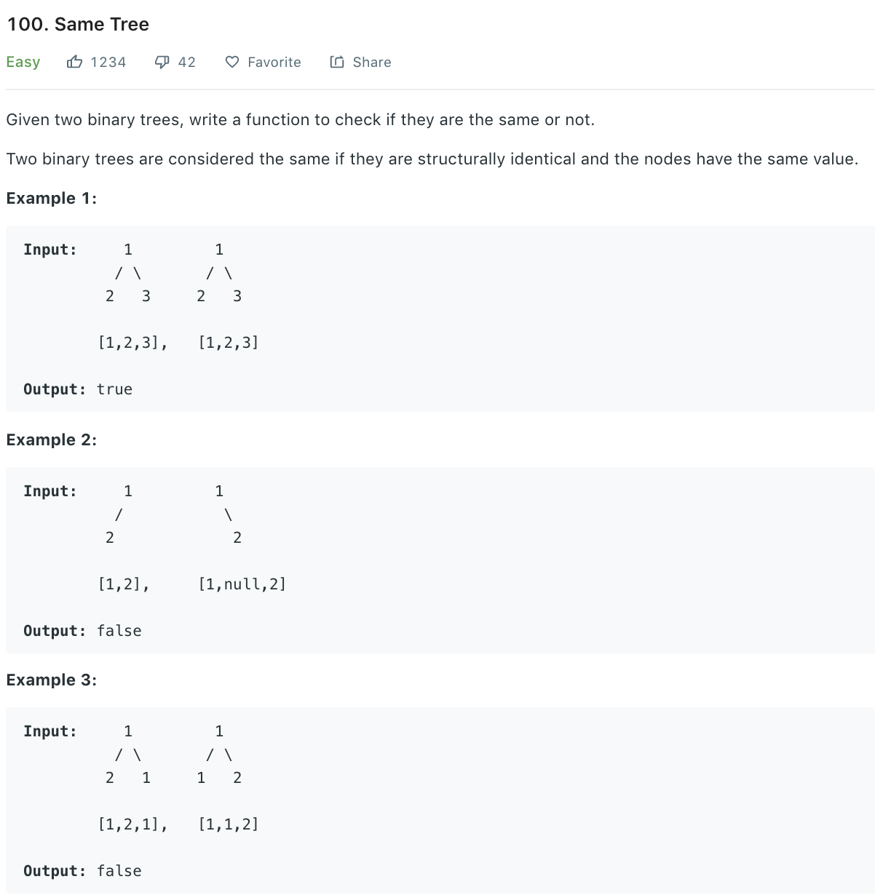

### Solution
Just traverse two trees and compare each node. Here we use preorder traversal.

```python
class Solution(object):
    def isSameTree(self, p, q):
        """
        :type p: TreeNode
        :type q: TreeNode
        :rtype: bool
        """
        if not p or not q:
            return p is q
        return (p.val == q.val) and self.isSameTree(p.left, q.left) \
               and self.isSameTree(p.right, q.right)
```
* Time complexity: O(N) as we visited all nodes<br>
* Space compelxity: O(h), h is stack depth or tree height, from log(N) to N.