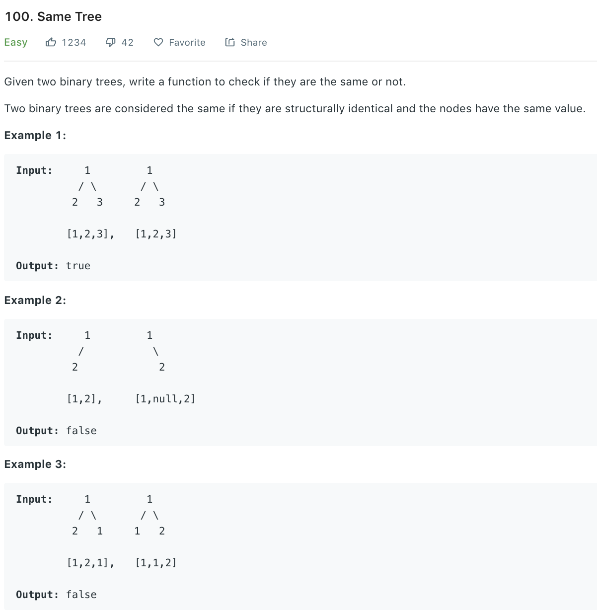

# Same Binary Tree


### Solution
Just traverse two trees and compare each node. Here we use preorder traversal.

```python
class Solution(object):
    def isSameTree(self, p, q):
        """
        :type p: TreeNode
        :type q: TreeNode
        :rtype: bool
        """
        if not p or not q:
            return p is q
        return (p.val == q.val) and self.isSameTree(p.left, q.left) \
               and self.isSameTree(p.right, q.right)
```
* Time complexity: O(N) as we visited all nodes<br>
* Space compelxity: O(h), h is stack depth or tree height, from log(N) to N.

### Iterative DFS
```python
class Solution:
    def isSameTree(self, p: Optional[TreeNode], q: Optional[TreeNode]) -> bool:
        stack = [(p, q)]

        while stack:
            node1, node2 = stack.pop()

            if not node1 and not node2:
                continue
            if not node1 or not node2 or node1.val != node2.val:
                return False

            stack.append((node1.right, node2.right))
            stack.append((node1.left, node2.left))

        return True
```

### BFS
```python
class Solution:
    def isSameTree(self, p: Optional[TreeNode], q: Optional[TreeNode]) -> bool:
        q1 = deque([p])
        q2 = deque([q])

        while q1 and q2:
            for _ in range(len(q1)):
                nodeP = q1.popleft()
                nodeQ = q2.popleft()

                if nodeP is None and nodeQ is None:
                    continue
                if nodeP is None or nodeQ is None or nodeP.val != nodeQ.val:
                    return False

                q1.append(nodeP.left)
                q1.append(nodeP.right)
                q2.append(nodeQ.left)
                q2.append(nodeQ.right)

        return True
```