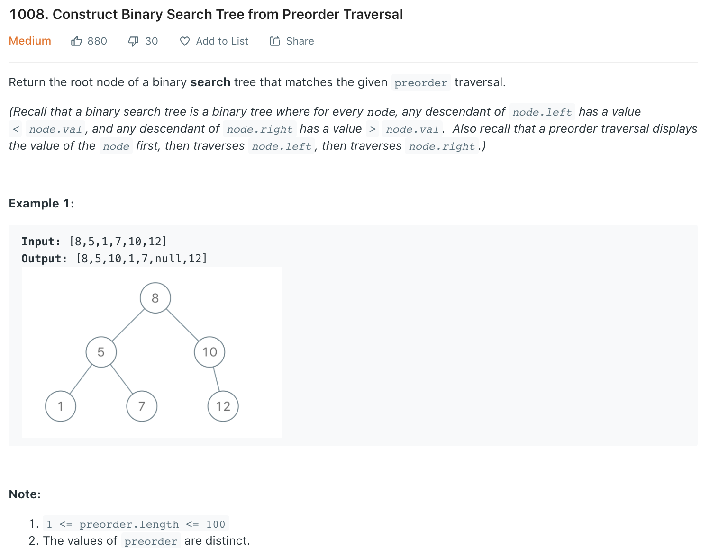

```python
class Solution(object):
    def bstFromPreorder(self, preorder):
        """
        :type preorder: List[int]
        :rtype: TreeNode
        """
        return self.helper(preorder, 0, len(preorder))
    
    def helper(self, pre, start, end):
        if start == end: return None
        
        rootVal = pre[start]
        l_end = start + 1
        while l_end < end and pre[l_end] < rootVal:
                l_end += 1
        
        root = TreeNode(rootVal)
        root.left = self.helper(pre, start+1, l_end)
        root.right = self.helper(pre, l_end, end)
        
        return root
```