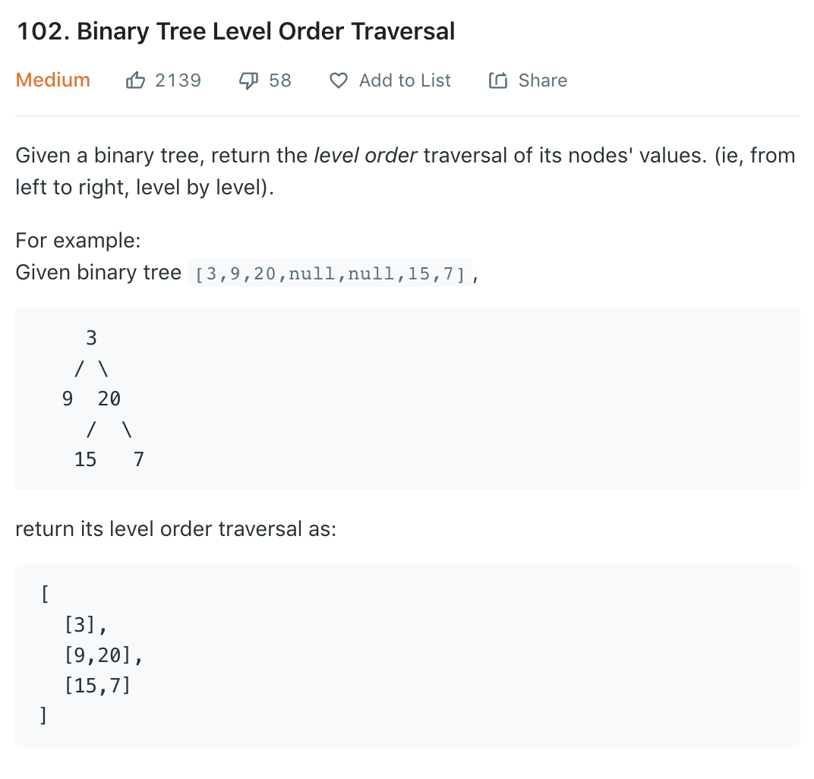

### Solution BFS
[97](97.md), [98](98.md), [101](101.md) all use BFS.
```python
class Solution(object):
    def levelOrder(self, root):
        """
        :type root: TreeNode
        :rtype: List[List[int]]
        """
        if not root: return []
        
        res = []
        fringe = [root]
        
        while fringe:
            level = []
            n = len(fringe)
            # n is number of nodes in current level
            for _ in range(n):
                cur = fringe.pop(0)
                level.append(cur.val)
                if cur.left:
                    fringe.append(cur.left)
                if cur.right:
                    fringe.append(cur.right)
            res.append(level)
        
        return res
```
### DFS
DFS, just need to pass in the number of current level
```python
def levelOrder(root):
    ans = []
    def dfs(root, level):
        if not root: return
        # no element in curretn level, initialize an empty list
        if len(ans) <= level:
            ans.append([])
        # add node value to current level
        ans[level].append(root.val)

        dfs(root.left, level + 1)
        dfs(root.right, level + 1)

    dfs(root, 0)
    return ans
```