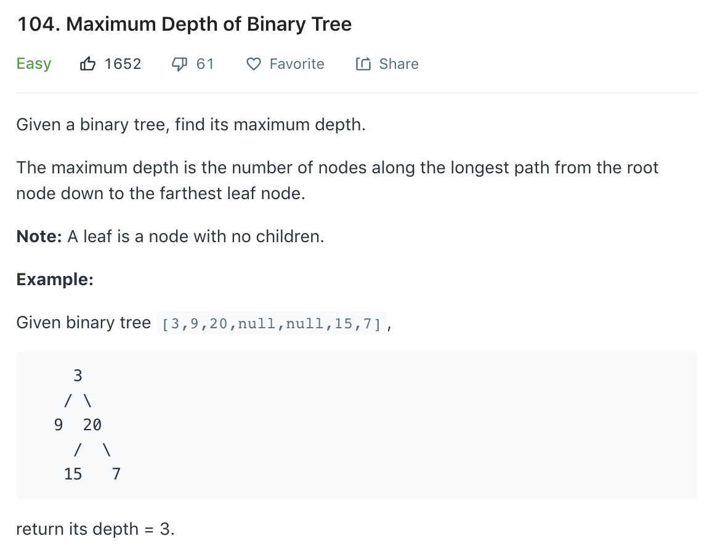

### Solution 1 naive
```python
class Solution(object):
    def maxDepth(self, root):
        if not root:
            return 0
        return 1 + max(self.maxDepth(root.left), self.maxDepth(root.right))
```
### Solution 2 level order traversal
```python
class Solution(object):
    def maxDepth(self, root):
        """
        :type root: TreeNode
        :rtype: int
        """
        if not root: return 0
        
        level = 0
        queue = [root]
        while queue:
            n = len(queue)
            level += 1
            for _ in range(n):
                node = queue.pop(0)
                if node.left:
                    queue.append(node.left)
                if node.right:
                    queue.append(node.right)

        return level 
```
### Solution 3 dfs
```python
class Solution(object):
    def maxDepth(self, root):
        if not root: return 0

        self.max_depth = 0
        self.helper(root, 1)
        return self.max_depth

    def helper(self, node, height):
    # update depth when reach leaf node
        if not node.left and not node.right:
            self.max_depth = max(self.max_depth, height)
            return
            # otherwise keep traversing
        if node.left:
            self.helper(node.left, height + 1)
        if node.right:
            self.helper(node.right, height + 1)
```