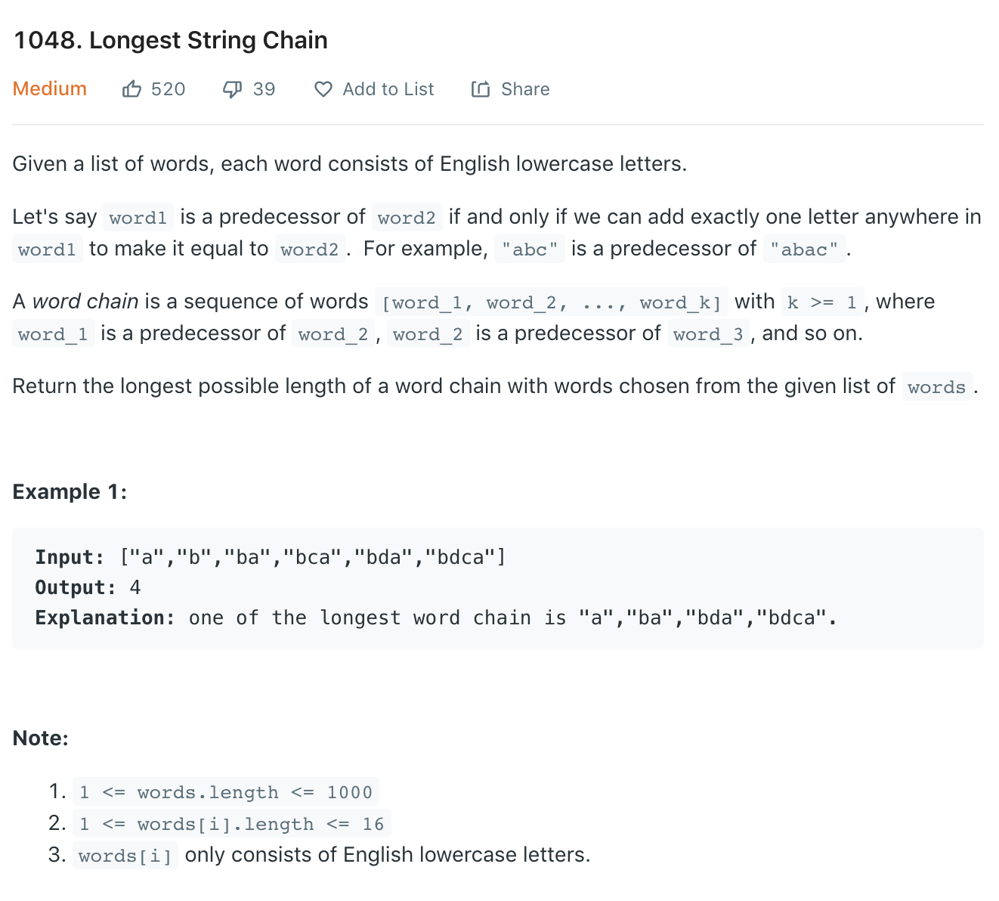

### Solution 1 TLE
```python
import collections
class Solution(object):
    def longestStrChain(self, words):
        """
        :type words: List[str]
        :rtype: int
        """
        if not words: return 0
        if len(words) < 2: return 1

        ans = 0
        predMap = collections.defaultdict(list)
        for i in range(len(words)):
            # for j in range(i + 1, len(words)):
            for j in range(len(words)):
                if self.isPredecessor(words[i], words[j]):
                    predMap[words[i]].append(words[j])

        # res = []
        # def dfs(w, path, res):
        #     if not predMap[w]:
        #         res.append(path)
        #         return
        #     for p in predMap[w]:
        #         dfs(p, path+[p], res)
        mem = {}
        def helper(w):
            if not predMap[w]:
                return 1

            if w in mem: return mem[w]

            depth = 0
            for p in predMap[w]:
                if helper(p) > depth:
                    depth = helper(p)
            mem[w] = depth + 1
            return depth + 1

        for i in range(len(words)):
            # dfs(words[i], [words[i]], res)
            tmp = helper(words[i])
            if tmp > ans:
                ans = tmp

        return ans

    #     return if w1 is pred of w2
    def isPredecessor(self, w1, w2):
        # if len(w1) > len(w2):
        #     w1, w2 = w2, w1
        if len(w1) + 1 != len(w2):
            return False
        for i in range(len(w2)):
            # w[:i], w[i:]
            if w1 == w2[:i] + w2[i+1:]:
                return True
        return False
```

### Solution 2 DP
```python
def longestChain(words):
    # must sort
    words.sort(key=len)
    res = 0
    dp = {}
    for word in words:
        best = 0
        for i in range(len(word)):
            prev = word[:i] + word[i+1:]
            best = max(best, dp.get(prev, 0) + 1)
        dp[word] = best
        res = max(res, best)

    return res
```