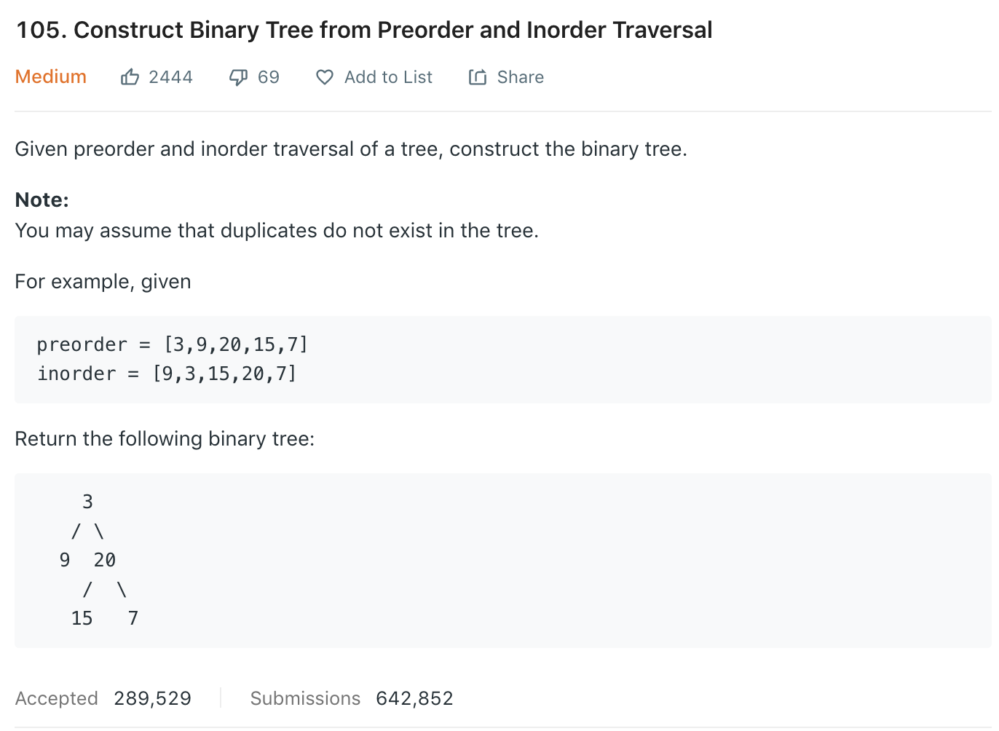

### Solution
```python
class Solution(object):
    def buildTree(self, preorder, inorder):
        """
        :type preorder: List[int]
        :type inorder: List[int]
        :rtype: TreeNode
        """
        inMap = {}
        for i, v in enumerate(inorder):
            inMap[v] = i

        def build(p_start, p_end, i_start, i_end):
            if p_start == p_end:
                return None

            root_idx = inMap[preorder[p_start]]
            root = TreeNode(preorder[p_start])
            left_len = root_idx - i_start

            root.left = build(p_start+1, p_start+left_len+1, i_start, root_idx)
            root.right = build(p_start+left_len+1, p_end, root_idx+1, i_end)
        return build(0, len(preorder), 0, len(inorder))
```