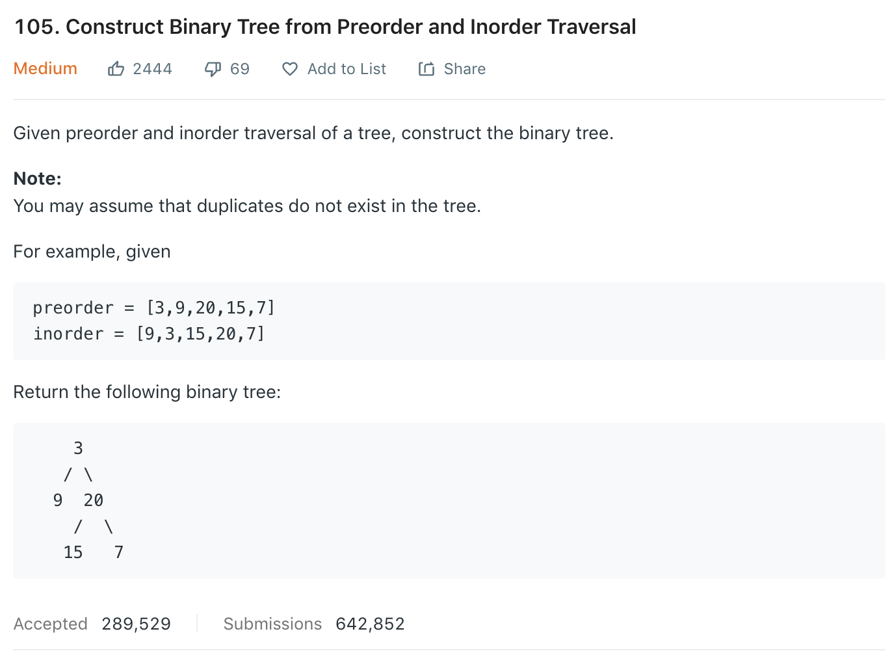

### Solution
```python
class Solution(object):
    def buildTree(self, preorder, inorder):
        """
        :type preorder: List[int]
        :type inorder: List[int]
        :rtype: TreeNode
        """
        inMap = {}
        for i, v in enumerate(inorder):
            inMap[v] = i

        def build(p_start, p_end, i_start, i_end):
            if p_start == p_end:
                return None

            root_idx = inMap[preorder[p_start]]
            root = TreeNode(preorder[p_start])
            left_len = root_idx - i_start

            root.left = build(p_start+1, p_start+left_len+1, i_start, root_idx)
            root.right = build(p_start+left_len+1, p_end, root_idx+1, i_end)
        return build(0, len(preorder), 0, len(inorder))
```
or
```python
def buildTree(preorder: List[int], inorder: List[int]) -> Optional[TreeNode]:
    def build(p1, p2, i1, i2):
        if p1 > p2: return None # needed in case a node has no left or right child
        root = TreeNode(preorder[p1])
        if p1 == p2: return root

        rIdx = inorder.index(preorder[p1])
        #left_len = rIdx-r1
        root.left = build(p1+1, p1+rIdx-i1, i1, rIdx-1) 
        root.right = build(p1+rIdx-i1+1, p2, rIdx+1, i2)
        return root

    return build(0, len(preorder)-1, 0, len(inorder)-1)
```
or
```python
def buildTree(preorder: List[int], inorder: List[int]) -> Optional[TreeNode]:
    if not inorder: return None
    root = TreeNode(preorder[0])
    if len(inorder) == 1: return root

    rootIdx = inorder.index(preorder[0])
    root.left = self.buildTree(preorder[1:1+rootIdx], inorder[:rootIdx])
    root.right = self.buildTree(preorder[1+rootIdx:], inorder[rootIdx+1:])
    return root
```