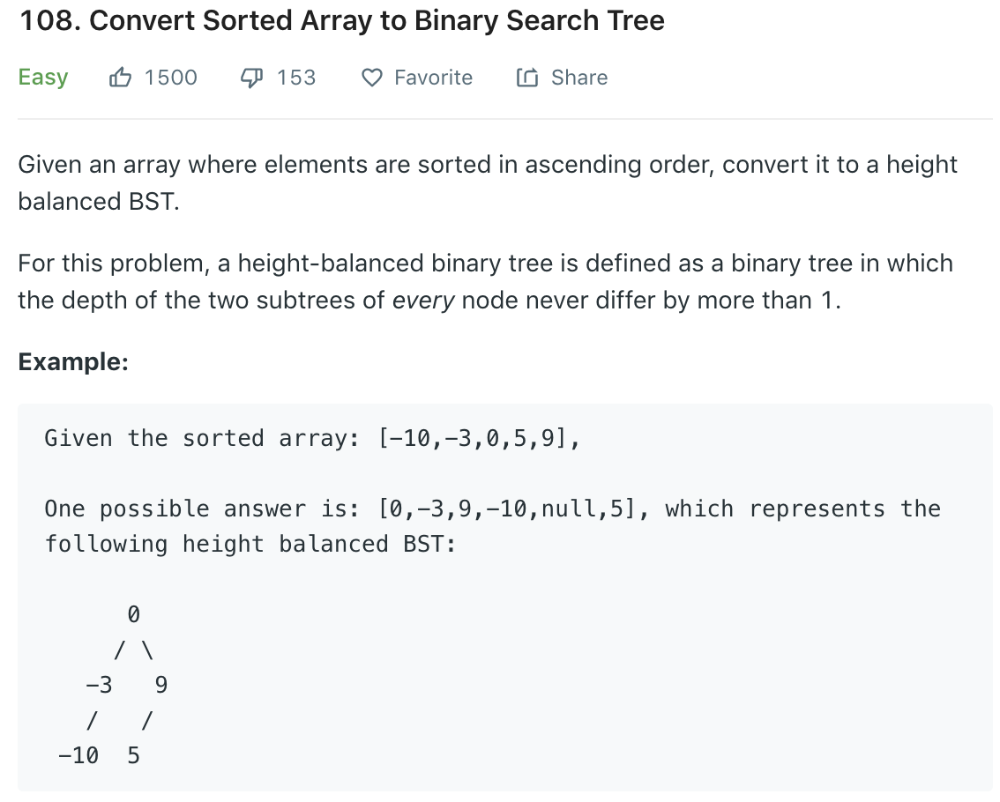

Similar to [98](98.md), [99](99.md), just pick the middle point as root to ensure balance
### Solution
```python
class Solution(object):
    def sortedArrayToBST(self, nums):
        """
        :type nums: List[int]
        :rtype: TreeNode
        """
        return self.helper(0, len(nums) - 1, nums)
    
    def helper(self, l, r, nums):
        if l > r:
            return None
        # redundant
        if l == r:
            return TreeNode(nums[l])
        mid = (l + r + 1) // 2
        root = TreeNode(nums[mid])
        root.left = self.helper(l, mid - 1, nums)
        root.right = self.helper(mid + 1, r, nums)
        return root
```