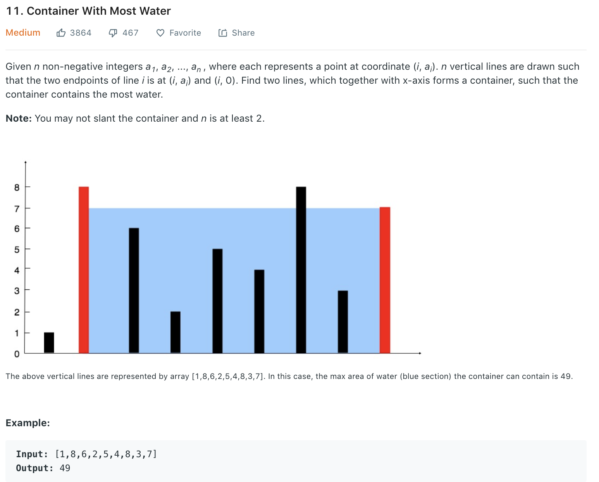

# Container with Most Water

### Solution
```python
class Solution(object):
    def maxArea(self, height):
        """
        :type height: List[int]
        :rtype: int
        """
        i, j = 0, len(height) - 1
        area = 0
        while i < j:
            h = min(height[i], height[j])
            area = max((j - i) * h, area)
            # then height[i] is the limiting factor for area (even if height[j] increase, still limited to the smaller height), thus can only increase height[i]
            # also if new left height must > height[i], otherwise area cannot grow as distance decreased
            if height[i]< height[j]:
                while height[i] <= h and i < j:
                    i += 1
            else:
                while height[j] <= h and i < j:
                    j -= 1
        return area

```