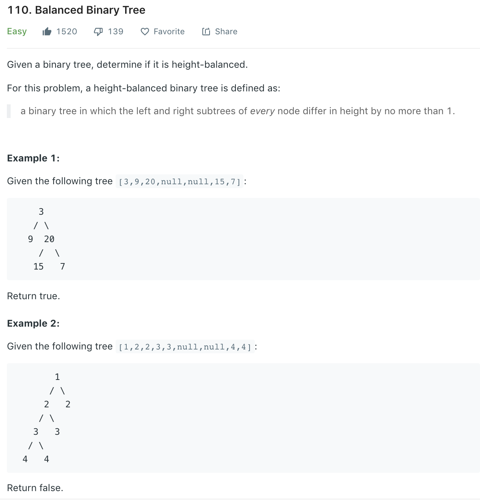

### Solution
```python
class Solution(object):
    def isBalanced(self, root):
        """
        :type root: TreeNode
        :rtype: bool
        """
        map = {None: 0}
        # use getHeight to store all node's height in map
        def getHeight(root, map):
            if root in map:
                return map[root]
            
            height = 1 + max(getHeight(root.left, map), getHeight(root.right, map))
            
            map[root] = height
            return height
        
        getHeight(root, map)
        return self.helper(root, map)
    
    def helper(self, root, map):
        if not root:
            return True
        if abs(map[root.left] - map[root.right]) > 1:
            return False
        return self.helper(root.left, map) and self.helper(root.right, map)
```