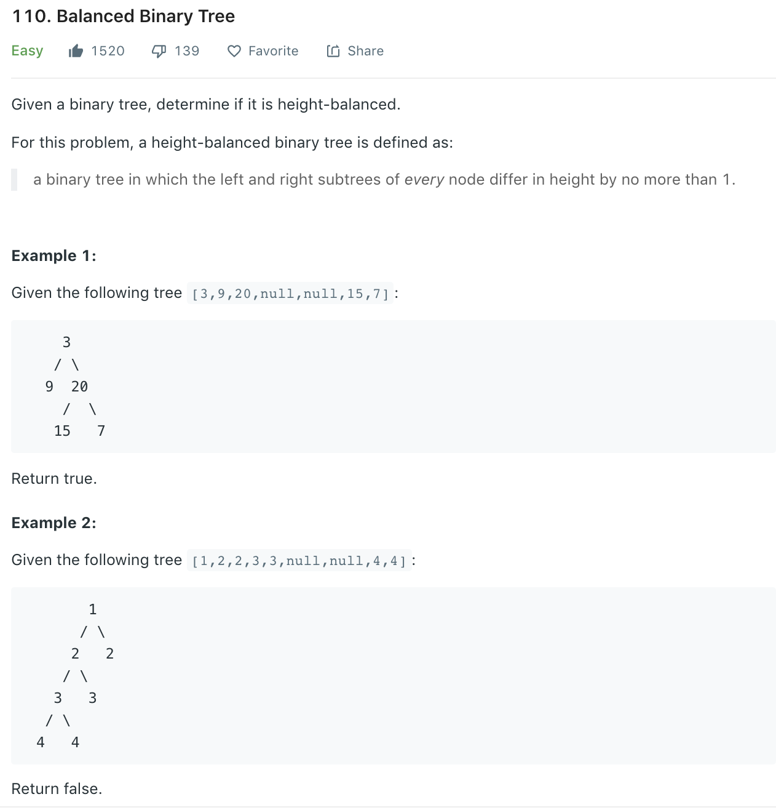

### Solution 1 Top-down
naive implementaion
```python
class Solution:
    def isBalanced(self, root: TreeNode) -> bool:
        if not root: return True
        return abs(self.depth(root.left) - self.depth(root.right)) <= 1 and \
            self.isBalanced(root.left) and self.isBalanced(root.right)

    def depth(self, root):
        if not root: return 0
        return max(self.depth(root.left), self.depth(root.right)) + 1
```
Add memoization to avoid repeating computation.
```python
class Solution(object):
    def isBalanced(self, root):
        """
        :type root: TreeNode
        :rtype: bool
        """
        map = {None: 0}
        # use getHeight to store all node's height in map
        def getHeight(root, map):
            if root in map:
                return map[root]
            
            height = 1 + max(getHeight(root.left, map), getHeight(root.right, map))
            
            map[root] = height
            return height
        
        getHeight(root, map) # [Pre-built map] get root height once will get height for all nodes in tree
        return self.helper(root, map)
    
    def helper(self, root, map):
        if not root:
            return True
        if abs(map[root.left] - map[root.right]) > 1:
            return False
        return self.helper(root.left, map) and self.helper(root.right, map)
```

```python
class Solution:
    def isBalanced(self, root: Optional[TreeNode]) -> bool:
        self.heightMap = dict() # make it an object variable so don't need to pass around. Also reset everytime we pass a new root (so consecutive call results are correct)
        if not root:
            return True
        return self.isBalanced(root.left) and self.isBalanced(root.right) and abs(self.getHeight(root.left) - self.getHeight(root.right)) <= 1 # !! issue: when call isBalanced iteratively heightMap will get reset/cleared! not really memorizing. FIX: define a helper function (in which do we not clear heightMap on recursion call)
    def getHeight(self, node): #[lazy calculate]
        if not node:
            return 0
        if node in self.heightMap:
            return self.heightMap[node]
        height = max(self.getHeight(node.left), self.getHeight(node.right)) + 1
        self.heightMap[node] = height
        return height
```
### Solution 2 Bottom-up + pruning
refer to [here](https://leetcode-cn.com/problems/ping-heng-er-cha-shu-lcof/solution/mian-shi-ti-55-ii-ping-heng-er-cha-shu-cong-di-zhi/).
```python
class Solution:
    def isBalanced(self, root: TreeNode) -> bool:
        # return tree depth if is balanced; else return -1
        def getTreeDepth(root): # !! why need a new function? 
        # because signature is not the same, this one will return int instead of boolean
            if not root: return 0

            left = getTreeDepth(root.left)
            # left subtree is not balanced, early pruning
            if left == -1: return -1

            right = getTreeDepth(root.right)
            if right == -1: return -1

            return max(left, right)+1 if abs(left-right)<=1 else -1
        
        return getTreeDepth(root) != -1
```
note getTreeDepth(curDepth, node) is counting from top to down (i.e., 从上往下同一层的同一个高度)，
但这里我们需要从下往上（i.e., curDepth = 1 + childDepth, not passed in)