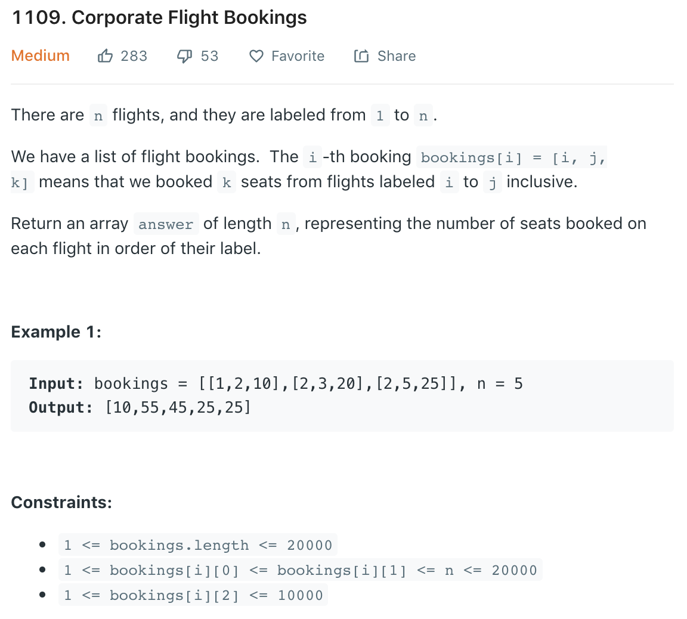
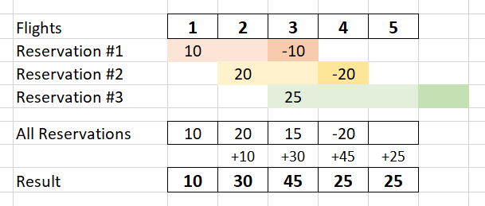

### Solution 1 TLE
```python
class Solution(object):
    def corpFlightBookings(self, bookings, n):
        """
        :type bookings: List[List[int]]
        :type n: int
        :rtype: List[int]
        """
        res = [0] * n
        for bk in bookings:
            for i in range(bk[0], bk[1]+1):
                res[i-1] += bk[2]
        
        return res
```
### Solution 2
Since ranges are continuous, what if we add reservations to the first flight in the range, and remove them after the last flight in range? We can then use the running sum to update reservations for all flights.

This picture shows the logic for this test case: [[1,2,10],[2,3,20],[3,5,25]].

```python
def corpFlightBookings(bookings, n):
    res = [0] * (n + 1)
    for i, j, k in bookings:
        res[i - 1] += k
        res[j] -= k
    for i in range(1, n):
        res[i] += res[i - 1]
    return res[:-1]
```