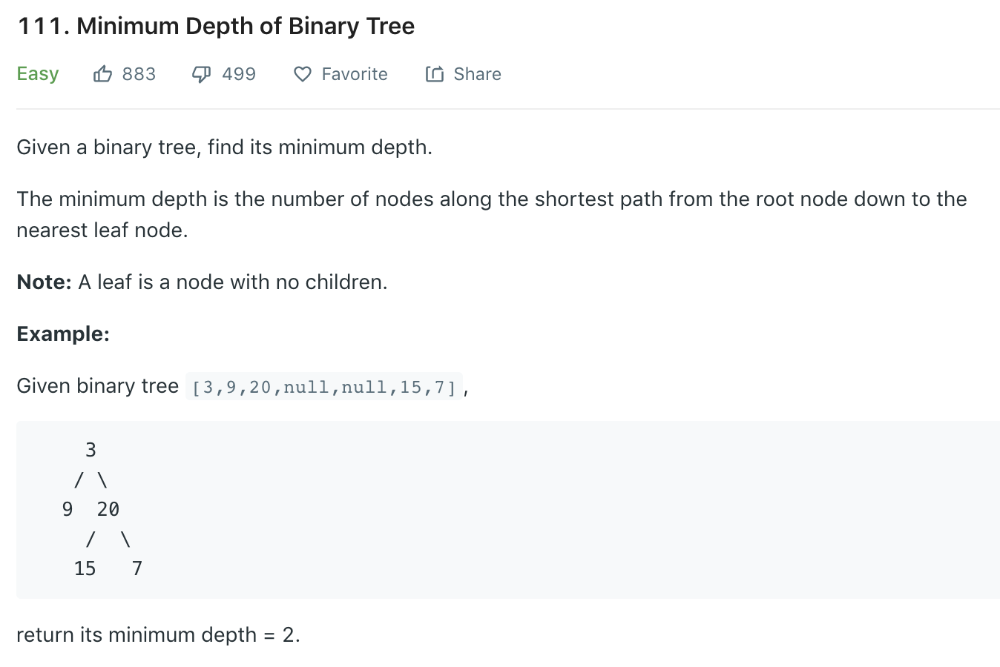

### Solution 1 
Similar to [104](104.md), however, we **cannot** just change the `max` to `min` in `Solution 1` . For below, it will take min height of 9 as 2 since its right child is None.
```
     3
    / \
   9   20
  /   /  \
 8   15   7
```
```python
class Solution(object):
    def minDepth(self, root):
        """
        :type root: TreeNode
        :rtype: int
        """
        if not root: return 0
        def helper(node):
            # return 1 if reach leaf
            if not node.left and not node.right:
                return 1
            # only consider right children if left is None
            if not node.left:
                return helper(node.right) + 1
            # only consider left children if right is None 
            if not node.right:
                return helper(node.left) + 1
            # choose a smaller one from both
            return min(helper(node.left), helper(node.right)) + 1
        
        return helper(root)
```

### Solution 2 level order
```python
class Solution(object):
    def minDepth(self, root):
        if not root: return 0
        queue = [root]
        level = 0
        while queue:
            level += 1
            n = len(queue)
            
            for _ in range(n):
                cur_node = queue.pop(0)
                # return current level first time reach a leaf
                if not cur_node.left and not cur_node.right:
                    return level
                
                if cur_node.left:
                    queue.append(cur_node.left)
                if cur_node.right:
                    queue.append(cur_node.right)
```