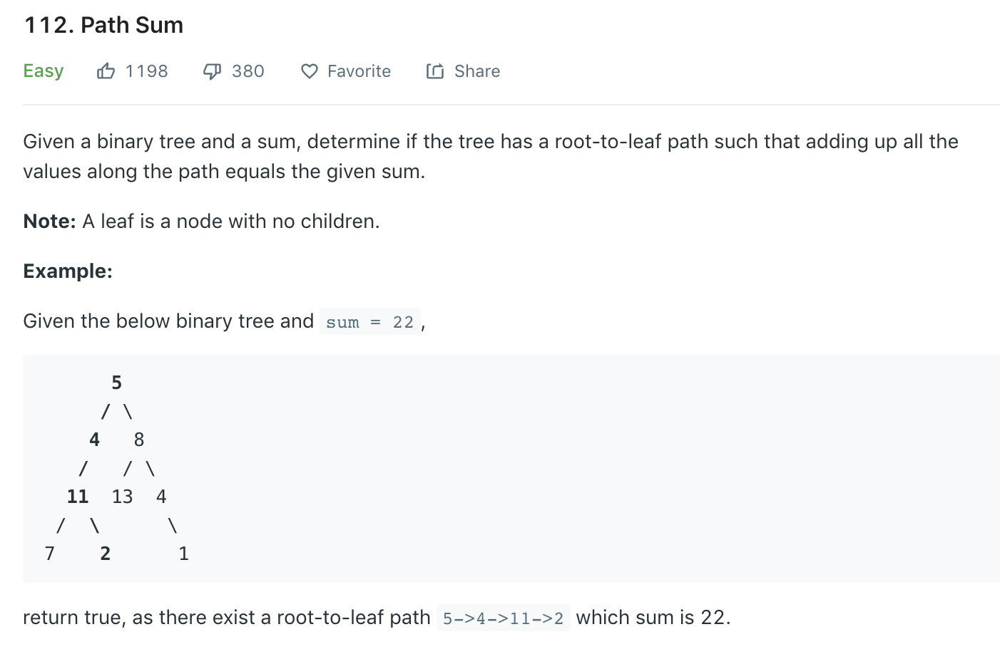

### Solution recursion
```python
class Solution(object):
    def hasPathSum(self, root, sum):
        """
        :type root: TreeNode
        :type sum: int
        :rtype: bool
        """
        if not root: return False
        if root.val == sum and not root.left and not root.right:
            return True
        return self.hasPathSum(root.left, sum - root.val) or self.hasPathSum(root.right, sum - root.val)
```

### Solution 2 bfs
```python
class Solution(object):
    def hasPathSum(self, root, sum):
        if not root: return False

        queue = [root]
        sumQueue = [root.val]
        while queue:
            cur_node = queue.pop(0)
            cur_sum = sumQueue.pop(0)
            # if we reach a leaf and the sum along the path is ok
            if cur_sum == sum and not cur_node.left and not cur_node.right:
                return True

            if cur_node.left:
                queue.append(cur_node.left)
                sumQueue.append(cur_sum + cur_node.left.val)
            
            if cur_node.right:
                queue.append(cur_node.right)
                sumQueue.append(cur_sum + cur_node.right.val)
        
        return False
```

### Solution 3 DFS
Similar to [94](94.md), use in-order traversal of DFS, and an extra stack to store total sum from root to current node.

To save more space, we can use a `curSum` to record accumulative sum from root to current node. Each time a node is pushed to the stack , we add its value, each time a node is popped, we subtract its value. However, in-order traversal cannot satisfy our need, as the root is already popped out of the stack when we visit the right child, so the value of the root is not included in `curSum`. The solution is to use `postorder traversal`, first left, then right, finally root.
```
     3
    / \
   9   20
  / \   
 8   15   

curSum = 0
3 in,  curSum = 3，3
9 in,  curSum = 12，3 -> 9
8 in,  curSum = 20， 3 -> 9 -> 8
8 out, curSum = 12， 3 -> 9
15 out, curSum = 27， 3 -> 9 -> 15
```
```python
def postOrder(root):
# res is the output
    res, toVisit = [], []
    cur, pre = root, None

    while cur or toVisit:
        while cur:
            toVisit.append(cur)# add root
            cur = cur.left# add left child

        cur = toVisit[-1]# already at the most left
        # if no right child or has already visited right child, visit root
        if not cur.right or cur.right == pre:
            toVisit.pop()
            res.append(cur.val)
            pre = cur
            cur = None
        else:
            # visit right child first if haven't
            cur = cur.right

    return res
```
Hence
```python
def hasPathSum(root, sum):
    toVisit = []
    cur, pre = root, None
    curSum = 0

    while cur or toVisit:
        while cur:
            toVisit.append(cur)
            # add value
            curSum += cur.val
            cur = cur.left
        cur = toVisit[-1]
        #
        if curSum == sum and not cur.left and not cur.right:
            return True

        # if no right child or have visited
        if not cur.right or cur.right == pre:
            toVisit.pop()#cur
            curSum -= cur.val
            pre = cur
            cur = None
        else:
            cur = cur.right

    return False
```