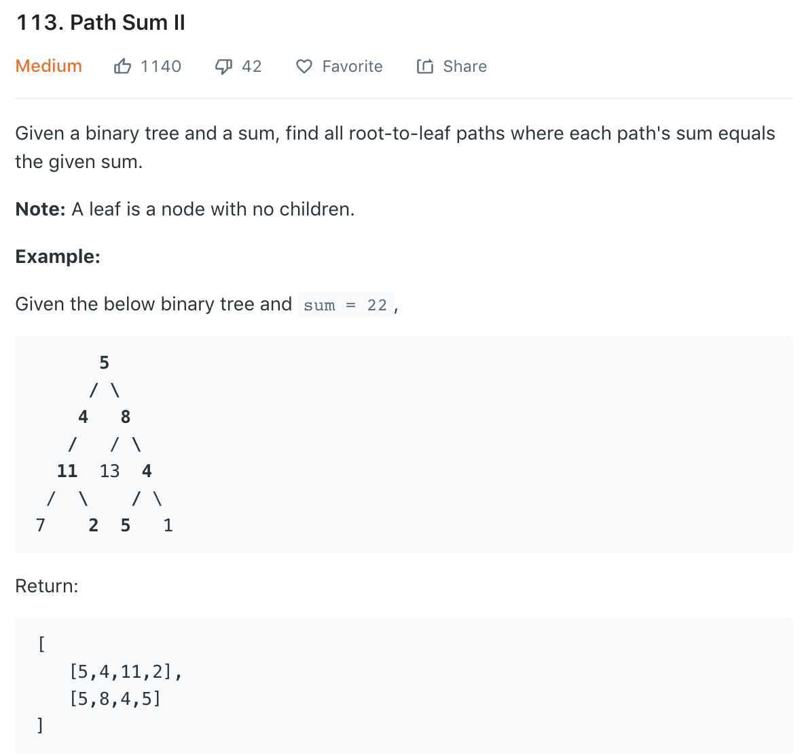

### Solution
```python
class Solution(object):
    def pathSum(self, root, sum):
        """
        :type root: TreeNode
        :type sum: int
        :rtype: List[List[int]]
        """
        res = []
        self.dfs(root, sum, [], res)
        return res

    def dfs(self, root, sum, path, res):
        if not root:
            return
        if not root.left and not root.right:
            if root.val == sum:
                # note must always generate a new path with `path + [root.val]`
                # cannot modify in-place as below:
                # path.append(root.val)
                # res.append(path)
                res.append(path + [root.val])
            return
        self.dfs(root.left, sum - root.val, path + [root.val], res)
        self.dfs(root.right, sum - root.val, path + [root.val], res)
```
or
```python
def pathSum(self, root: Optional[TreeNode], targetSum: int) -> List[List[int]]:
    res = []
    def dfs(node, curPath, rem):
        if not node.left and not node.right:
            if rem == node.val:
                res.append(curPath)
            return
        
        if node.left:
            dfs(node.left, curPath + [node.left.val], rem-node.val)
        if node.right:
            dfs(node.right, curPath + [node.right.val], rem-node.val)


    if not root: return res
    dfs(root, [root.val], targetSum)
    return res
```

Or return
```python
def pathSum(self, root, sum):
    if not root:
        return
    if root.val == sum and not root.left and not root.right:
        return [[root.val]]

    res = []
    left_subs = self.pathSum(root.left, sum - root.val)
    right_subs = self.pathSum(root.right, sum - root.val)

    if left_subs:
        for left_sub in left_subs:
            res.append([root.val] + left_sub)
    if right_subs:
        for right_sub in right_subs:
            res.append([root.val] + right_sub)

    return res
```
