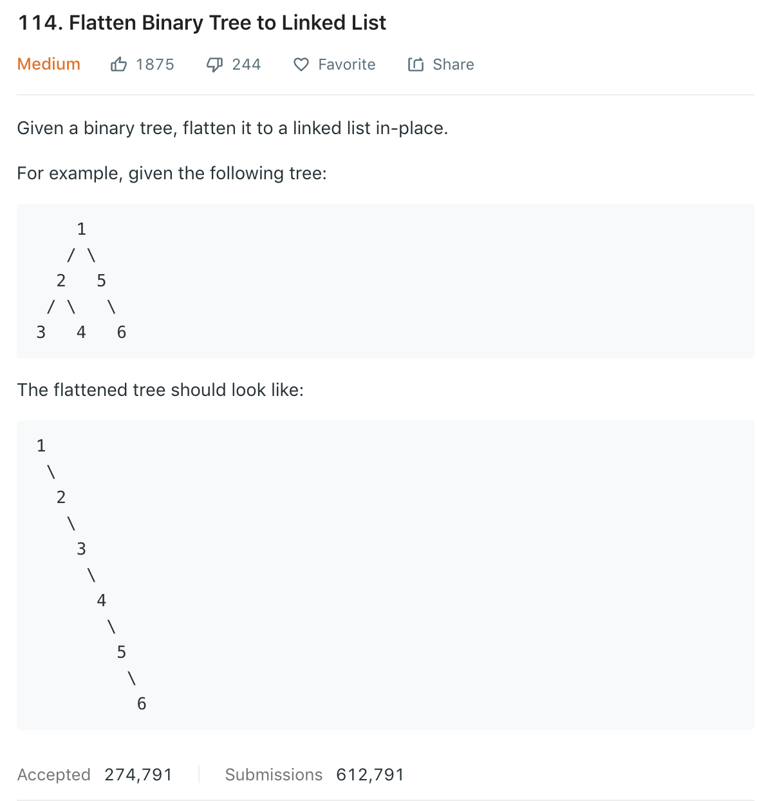

<<<<<<< HEAD
### Solution 1
Refer to [here](https://leetcode.com/problems/flatten-binary-tree-to-linked-list/discuss/36977/My-short-post-order-traversal-Java-solution-for-share). This is a `pre-order` traversal of binary tree. Steps are:
```
1. Move right sub-tree to the right-most node of left child.
2. Move left sub-tree to the right child of root.
3. Consider new root as the right sub-tree, continue above process until there is no right child.
    1
   / \
  2   5
 / \   \
3   4   6
-----------        
pre = 5
cur = 4

    1
   / 
  2   
 / \   
3   4
     \
      5
       \
        6
-----------        
pre = 4
cur = 3

    1
   / 
  2   
 /   
3 
 \
  4
   \
    5
     \
      6
-----------        
cur = 2
pre = 3

    1
   / 
  2   
   \
    3 
     \
      4
       \
        5
         \
          6
-----------        
cur = 1
pre = 2

1
 \
  2
   \
    3
     \
      4
       \
        5
         \
          6
```
```python
class Solution(object):
    def flatten(self, root):
        """
        :type root: TreeNode
        :rtype: None Do not return anything, modify root in-place instead.
        """
        while root:
            if root.left:
                prev = root.left
                while prev.right:
                    prev = prev.right
                
                prev.right = root.right
                root.right = root.left
                root.left = None
            
            root = root.right
```

### Solution 2 recursion
Refer to [here](https://leetcode.com/problems/flatten-binary-tree-to-linked-list/discuss/36977/My-short-post-order-traversal-Java-solution-for-share).
We actually want to do a pre-order traversal, for each node visited, we udpate the right child of last node to current node. 
```
    1
   / \
  2   5
 / \   \
3   4   6

```
```
1 -> 2 -> 3 -> 4 -> 5 -> 6
when reach 2, set right child of 1 to 2 1 -> 2 3 4 5 6
when reach 3, 1 -> 2 -> 3 4 5 6
```
However, the problem is that if we set node's right child to another node, the original right child will be lost.
One solution is to do it reversely. Each time visiting a node, set its right child to last node
```
6 5 4 3 2 1
at 5, 6 <- 5 4 3 2 1
at 4, 6 <- 5 <- 4 3 2 1
```
Thus we won't lose right child as when we update right child of current node, its right child is already visited.
What we do is actually a variant of post-order traversal ```right child -> left child -> root```
```python
class Solution(object):
    def __init__(self):
        self.pre = None
        
    def flatten(self, root):
        if not root:
            return
        self.flatten(root.right)
        self.flatten(root.left)
        # do not print the current node:root
        # instead, use a global var `pre`, update right child of current root to `pre`, update left child to `null`
        root.right = self.pre
        root.left = None
        self.pre = root
```
Using iterative post-order traversl similar to [112](112.md)
```python
def flatten(root):
    toVisit = []
    cur = root
    pre = None

    while cur or toVisit:
        while cur:
            toVisit.append(cur)#add root
            cur = cur.right#add right child recursively
        cur = toVisit[-1]#already at right-most
        if not cur.left or cur.left is pre:
            toVisit.pop()
            #*******modification***********
            cur.right = pre
            cur.left = None
            #******************************
            pre = cur
            cur = None
        else:
            cur = cur.left#vistit left node first if haven't yet
```

### Solution 3
Refer to [here](https://leetcode.com/problems/flatten-binary-tree-to-linked-list/discuss/36991/Accepted-simple-Java-solution-iterative).

In Solution 2 we know that we will lost right child using pre-order traversal. This can actually be solved using below.

First look at a normal iterative pre-order traversal:
```python
def preOrder(root):
    if not root: return
    stack = []
    while not root or not stack:
        whle not root:
        # the output of pre-order
        print(root.val)
        s.append(root)
        root = root.left
    # output of in-order
    root = stack.pop()
    root = root.right
```
There is actually a special kind of pre-order which stores right child in stack in advance. Thus we can prevent losing right child. Since stack is FILO, we push right child first.
```python
def preOrderStack(root):
    if not root: return
    stack = [root]
    while stack:
        tmp = stack.pop()
        # output
        print(tmp.val)
        if tmp.right:
            s.append(tmp.right)
        if tmp.left:
            s.append(tmp.left)
```
Now we can do pre-order traversal, each time visit a node, set last node's right child to current one. This time we don't need to worry about losing right child since it's stored in stack. We use `pre` to store last visited node.
```python
def flatten(root):
    if not root: return
    s = [root]
    pre = None
    while s:
        tmp = s.pop()
        #~~~~~~~~~~~~~~~
        if pre:
            pre.right = tmp
            pre.left = None
        #~~~~~~~~~~~~~~~~
        if tmp.right:
            s.append(tmp.right)
        if tmp.left:
            s.append(tmp.left)
        #~~~~~~~~~~~~~~~~
        pre = tmp
```
=======
### Solution
>>>>>>> 633bfcc9af9303189ca4e057234f61262853d57a
