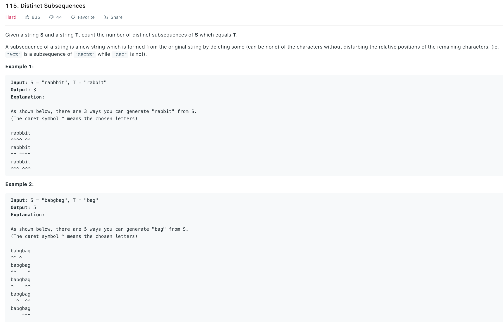

### Solution 1 brutal force TLE
```python
class Solution:
    def numDistinct(self, s, t):
        """
        :type s: str
        :type t: str
        :rtype: int
        """
        self.count = 0
        self.dfs2(s, t, 0, 0)
        return self.count

    # try to find subsequence of t starting from jth char from subsequence of s starting from ith...
    def dfs2(self, s, t, i, j):
        # find a qualified substring, count++
        if j == len(t):
            self.count += 1
            return
        for start in range(i, len(s)):
            if s[start] == t[j]:
                self.dfs2(s, t, start + 1, j + 1)
```
### Solution 2
Similar to solution 1, we either `use` or do `not` use current character in s. Instead of count++ when reach the end, return number of ways.
```python
def numDistinct(s, t):
    def helper(s, s_start, t, t_start):
        if t_start == len(t):
            return 1
        if s_start == len(s):
            return 0
        if s[s_start] == t[t_start]:
            return helper(s, s_start + 1, t, t_start + 1) + helper(s, s_start + 1, t, t_start)
        else:
            return helper(s, s_start + 1, t, t_start)
    return helper(s, 0, t, 0)
```
This will also cause TLE. Add memoization:
```python
def numDistinct(self, s, t):
    memo = {}
    def helper(s, s_start, t, t_start):
        if t_start == len(t):
            return 1
        if s_start == len(s):
            return 0

        key = str(s_start) + "#" + str(t_start)
        if key in memo:
            return memo[key]

        # scope promotion        
        num = 0
        if s[s_start] == t[t_start]:
            num = helper(s, s_start + 1, t, t_start + 1) + helper(s, s_start + 1, t, t_start)
        else:
            num = helper(s, s_start + 1, t, t_start)

        memo[key] = num
        return num
    
    return helper(s, 0, t, 0)
```
### Solution 3 DP

dp[i][j] represents number of ways to select `t[:i]` from `s[:j]`. So
* dp[0][j] = 1 Only 1 way (select none) to get a "" from s[:j]
* dp[i][0] = 0, i > 0, no way to get t[:i] from ""
* if t[i-1]==s[j-1]:
  * use s[j-1], then dp[i-1][j-1] 
  * do not use s[j-1], then its dp[i][j-1]
* t[i-1] != s[j-1]:
  cannot use s[j-1], so dp[i][j-1]
```
     b   a   b   g   b   b   g
  1  1   1   1   1   1   1   1
b 0  1   1   2   2   3   3   3        
a 0  0   1   1   1   1   4   4            
g 0  0   0   0   1   1   1   5                   
```
```python
def numDistinct(s, t):
    dp = [[0] * (len(s) + 1) for _ in range(len(t) + 1)]
    for j in range(len(s) + 1):
        dp[0][j] = 1
    
    for i in range(1, len(t) + 1):
        for j in range(1, len(s) + 1):
            if t[i - 1] == s[j - 1]:
                dp[i][j] = dp[i - 1][j - 1] + dp[i][j - 1]
            else:
                dp[i][j] = dp[i][j - 1]
```
Space opt
We only need one array instead of a 2-d array, note since dp[i-1][j-1] is lost, we need an extra `pre` to store taht value.

```python
def numDistinct(s, t):
    dp = [1] * (len(s) + 1)
    dp[0] = 0
    for i in range(1, len(t) + 1):
        #Note 
        pre = 1 if i == 1 else 0
        for j in range(1, len(s) + 1):
            tmp = dp[j]
            if t[i-1] == s[j-1]:
                dp[j] = pre + dp[j - 1]
            else:
                dp[j] = dp[j-1]
            pre = tmp

    return dp[-1]
```
