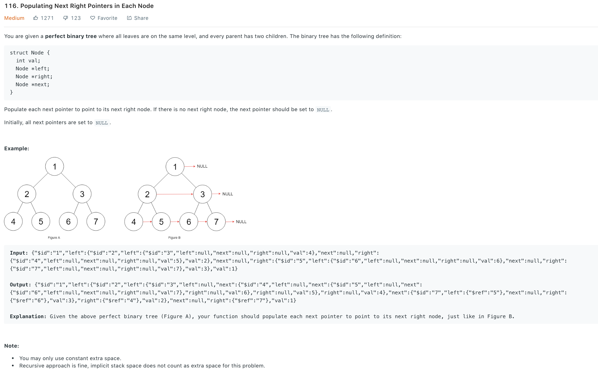
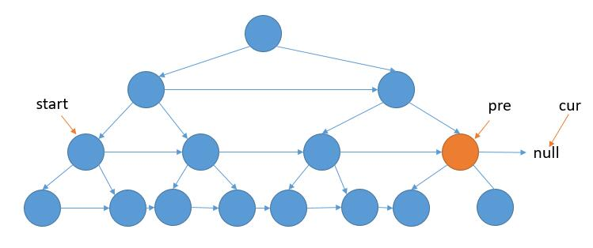

### Solution BFS with extra space
It's trivial if we can use an extra queue to do BFS.
```python
# Definition for a Node.
class Node(object):
    def __init__(self, val, left, right, next):
        self.val = val
        self.left = left
        self.right = right
        self.next = next

class Solution(object):
    def connect(self, root):
        """
        :type root: Node
        :rtype: Node
        """
        if not root: return root
        
        queue = [root]
        while queue:
            # pre = queue[0]
            size = len(queue)
            pre = None
            for i in range(size):
                cur = queue.pop(0)
                if i > 0:
                    pre.next = cur
                    # pre = cur
                pre = cur
                
                if cur.left: queue.append(cur.left)
                if cur.right: queue.append(cur.right)
        
        return root
```

### Solution 2
See below, `start` is the first node in each layer, `pre` and  `cur` are what we are visiting in the current layer.


```python
def connect(root):
    if not root: return root

    pre, cur = root, None
    start = pre
    while pre.left:
        # reach right-most, move pre, cur to next level and update start
        if not cur:
            # just need to 
            pre.left.next = pre.right

            pre = start.left
            cur = start.right
            start = pre
        # link next of next layer, move forward pre, next
        else:
            # point pre.left.next to pre.right
            pre.left.next = pre.right
            # point pre.right.next to cur.left
            pre.right.next = cur.left

            pre = pre.next
            cur = cur.next
    
    return root
```
A more clear way:
pre is the start node of each level, cur the node we are currently visiting in `pre`'s level.
```python
def connect(root):
    if not root: return root
    pre, cur = root, None
    # still need to connect nodes in next level
    while pre.left:
        # start from left-most node of current level
        cur = pre
        # move along right 
        while cur:
            cur.left.next = cur.right
            if cur.next:
                cur.right.next = cur.next.left
            cur = cur.next
        pre = pre.left
    
    return root
```