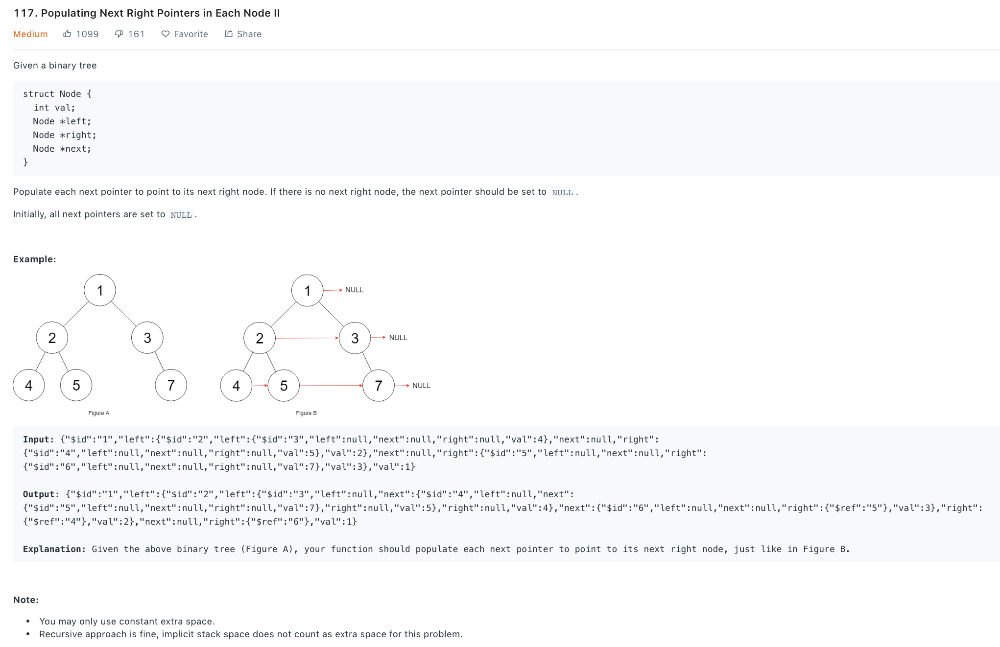
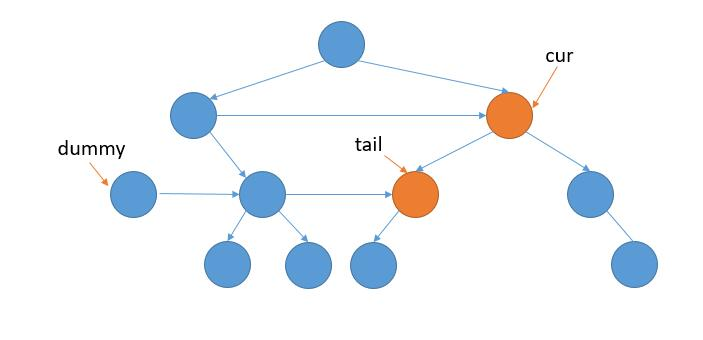

### Solution 1
We can just use the BFS solution from [116](116.md) with extra spaces.
### Solution 2
One way is based on solution in [116](116.md). The problmes that we need to solve is 
```
cur.left.next = cur.right;
cur.right.next = cur.next.left;
```
that we cannot ensure whether `cur.left` or `cur.right` or `cur.next.left` or `cur.right.next` is None or not. So we need to ensure current node has at least one child using a loop. However, this is clumsy.

A more elegant way (refer to [here](https://leetcode.com/problems/populating-next-right-pointers-in-each-node-ii/discuss/37979/O(1))). In : we use `cur` and next to traverse current level, use `dummy` to point to the first node of next level, while child of cur is not None, add it to `tail` and move `tail` forward.
```python
def connect(root):
    cur = root
    while cur:
        dummy = Node()
        tail = dummy
        
        while cur:
            # handle None
            if cur.left:
                tail.next = cur.left
                tail = tail.next
            if cur.right:
                tail.next = cur.right
                tail = tail.next
            cur = cur.next
        
        cur = dummy.next
    
    return root
```