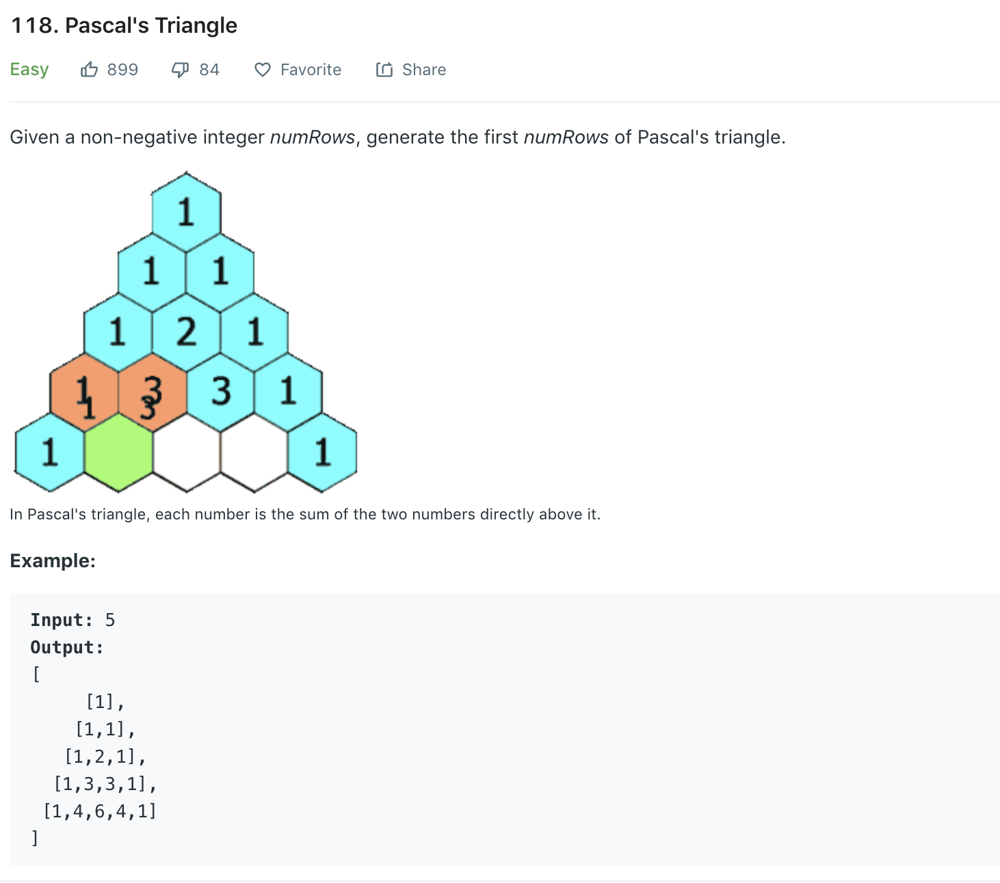

### Solution
```python
class Solution(object):
    def generate(self, numRows):
        """
        :type numRows: int
        :rtype: List[List[int]]
        """
        if numRows == 0: return []
        if numRows == 1: return [[1]]
        res = [[1], [1, 1]]
        
        for line in range(3, numRows + 1):
            tmp = [1] * line
            last = res[-1]
            for i in range(1, line-1):
                tmp[i] = last[i-1] + last[i]
            
            res.append(tmp)
        
        return res
```