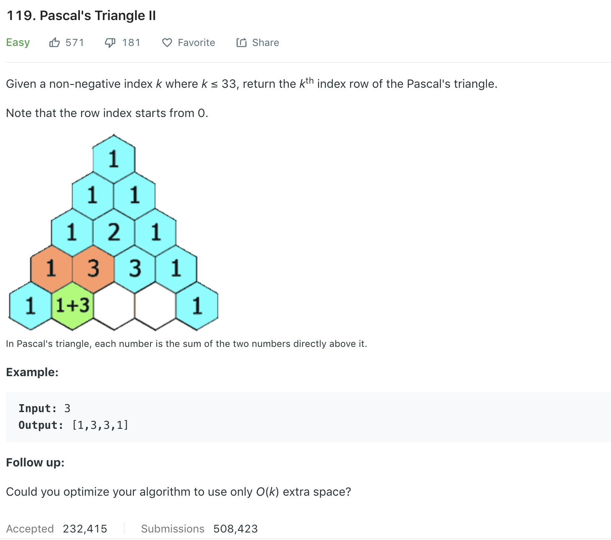

### Solution
```python
class Solution(object):
    def getRow(self, N):
        """
        :type rowIndex: int
        :rtype: List[int]
        """
        ret = [1]
        for i in range(1, N+1):
            for j in reversed(range(1, i)):
                ret[j] += ret[j - 1]
            ret.append(1)
        return ret
```