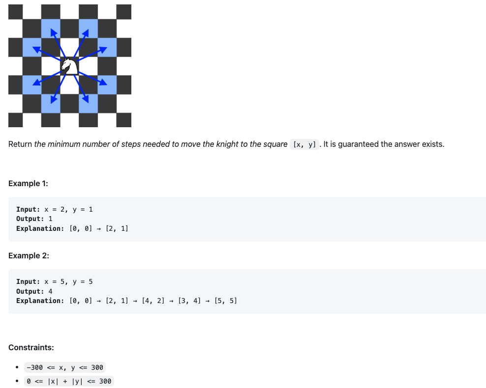

### Question
In an infinite chess board with coordinates from -infinity to +infinity, you have a knight at square [0, 0].

A knight has 8 possible moves it can make, as illustrated below. Each move is two squares in a cardinal direction, then one square in an orthogonal direction.

### Solution
1. BFS

effectively treat chess board as a graph, edge is 8 moving directions

BFS to find shortest path from (0, 0) to (x, y)

search path is a square with (0, 0) center and keep increasing size to outside...

2. Optimized

This problem can be solved using the BFS shortest path model. The search space for this problem is not large, so we can directly use the naive BFS. The solution below also provides the code for bidirectional BFS for reference.

Bidirectional BFS is a common optimization method for BFS. The main implementation ideas are as follows:

Create two queues, q1 and q2, for "start -> end" and "end -> start" search directions, respectively.
Create two hash maps, m1 and m2, to record the visited nodes and their corresponding expansion times (steps).
During each search, prioritize the queue with fewer elements for search expansion. If a node visited from the other direction is found during the expansion, it means the shortest path has been found.
If one of the queues is empty, it means that the search in the current direction cannot continue, indicating that the start and end points are not connected, and there is no need to continue the search.