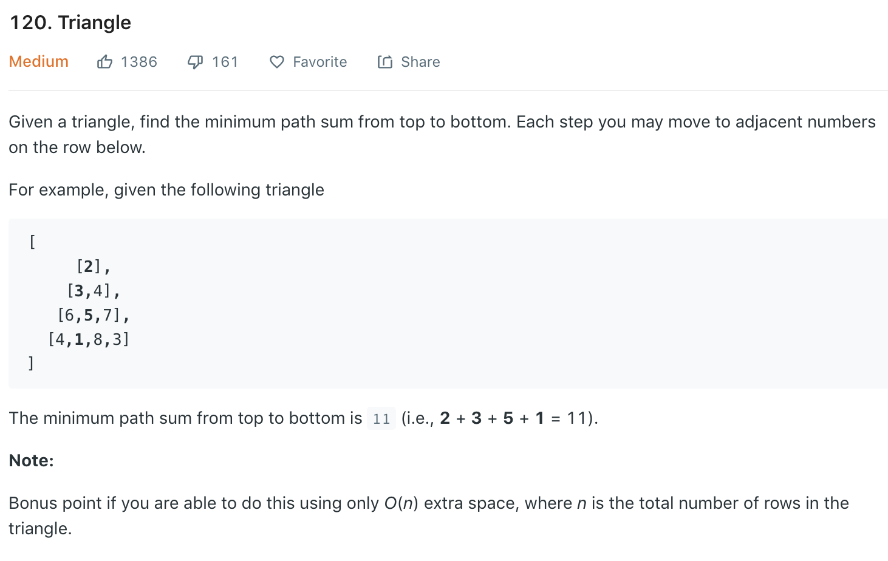

Similar to [115](115.md).
### Solution Brutal Force
DFS - tail (using class var)
```python
class Solution(object):
    def minimumTotal(self, triangle):
        """
        :type triangle: List[List[int]]
        :rtype: int
        """
        self.min_sum = float('inf')
        def helper(i, j, cur_sum):
            if i == len(triangle):
                self.min_sum = min(cur_sum, self.min_sum)
                return
            
            helper(i + 1, j, cur_sum + triangle[i][j])
            # index always valid             
            helper(i + 1, j + 1, cur_sum + triangle[i][j])
        
        helper(0, 0, 0)
        return self.min_sum
```
+ Time complexity: O(2^k), k is number of level
Similarly, DFS - head (return )
```python
def minimumTotal(triangle):
    # added memoization
    mem = dict()
    # return min sum starting from triangle[i][j] to leaf
    def helper(i, j):
        k = str(i) + '#' + str(j)
        if k in mem: return mem[k]
        
        # base: reach leaf
        if i == len(triangle) - 1:
            return triangle[i][j]
        
        res = triangle[i][j] + min(helper(i + 1, j), helper(i + 1, j + 1))

        mem[k] = res
        return res
    
    return helper(0, 0)
```
### Solution 2 DP
dp[i][j] is the min sum along the path starting from triangle[i][j] to the last level.
```python
def minimumTotal(triangle):
    dp = []
    n = len(triangle)
    for i in range(n):
        dp.append([0] * (i + 1))
    
    for j in range(n):
        dp[-1][j] = triangle[-1][j]
    
    for i in reversed(range(n - 1)):
        for j in range(i + 1):
            dp[i][j] = triangle[i][j] + min(dp[i + 1][j], dp[i + 1][j + 1])
    
    return dp[0][0]
```