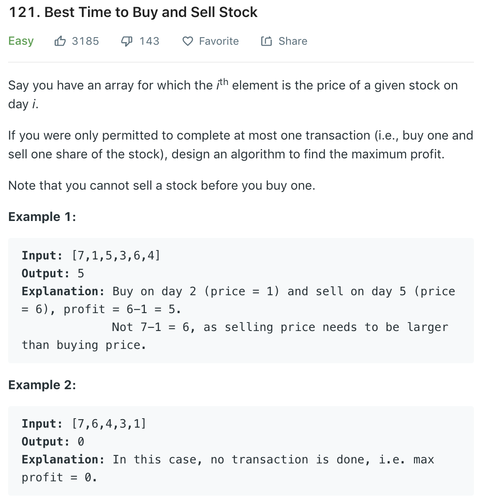

We do not consider brutal force here.
### Solution 1 two pointer
`minPrice` is price at buy, iterate through `price` as price at sell. 
```python
class Solution(object):
    def maxProfit(self, prices):
        """
        :type prices: List[int]
        :rtype: int
        """
        profit = 0
        if not prices: return profit

        # the lowest prices so far
        minPrice = prices[0]
        for price in prices:
            if price < minPrice:
                minPrice = price
            profit = max(profit, price - minPrice)

        return profit
```
### Solution 2
Refer to [here](https://leetcode.com/problems/best-time-to-buy-and-sell-stock/discuss/39038/Kadane's-Algorithm-Since-no-one-has-mentioned-about-this-so-far-%3A)-(In-case-if-interviewer-twists-the-input). Recall [53](53.md), we us dp to calculate largets sum of contiguous subarray.

For this problem, `1 6 2 8` represents stock prices each day, subtract price of previous day from current day, we have `0 5 -4 6`, which reflects price variation. Thus we only need to find largest contiguous sum. e.g., if sum is from day 3 to day 6, then we should buy at day 2 and sell at day 6.
```python
def maxProfit(prices):
    maxCur, res = 0, 0
    for i in range(1, len(prices)):
        maxCur = max(0, maxCur + prices[i] - prices[i - 1])
        res = max(maxCur, res)

    return res
```