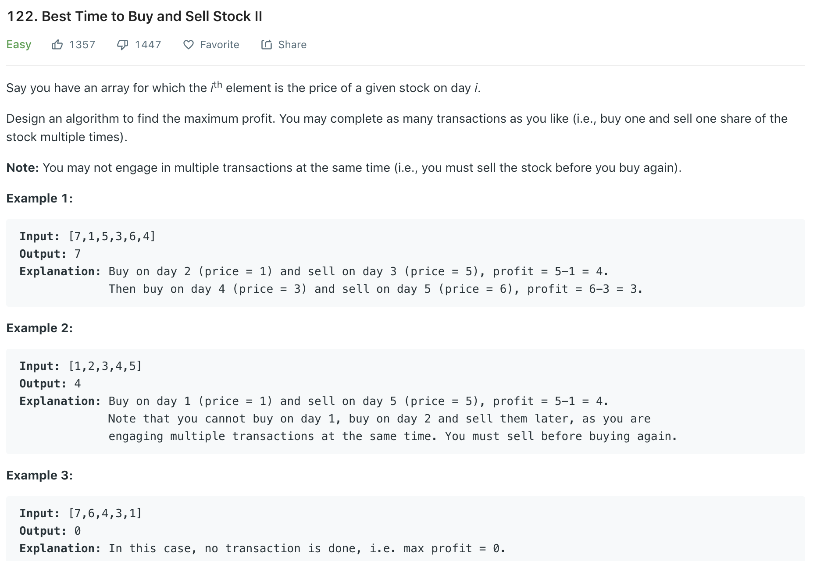

### Solution
Since number of buy and sell is unlimited, we only need to gather all increments. As long as the price if higher than previous day, make a buy-and-sell.
```python
class Solution(object):
    def maxProfit(self, prices):
        """
        :type prices: List[int]
        :rtype: int
        """
        res = 0
        for i in range(1, len(prices)):
            # faster than using max
            if prices[i] > prices[i - 1]:
                res += prices[i] - prices[i - 1]
            # res += max(0, prices[i] - prices[i - 1])
        return res
```