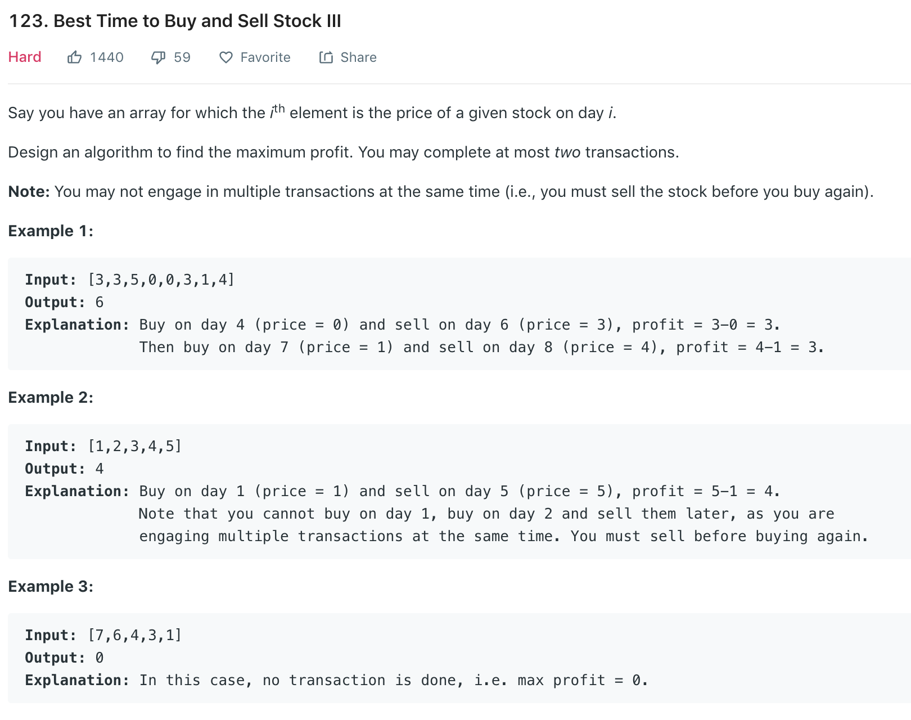
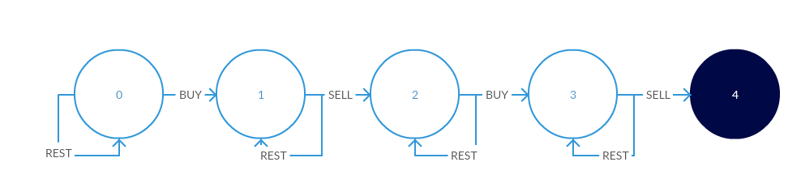

### Solution 1
```python
def maxProfic(prices):
    if not prices:
        return 0

    K = 2
    dp = [0] * (K + 1)
    m = [0] * (K + 1)
    for i in range(1, K + 1):
        m[i] = prices[0]

    for i in range(1, len(prices)):
        for k in range(1, K + 1):
            m[k] = min(prices[i] - dp[k - 1], m[k])
            dp[k] = max(dp[k], prices[i] - m[k])

    return dp[K]
```
since K is constant 2, so `m` and `dp` array can be represented by 2 var.
```python
def maxProfit(prices):
    if not prices: return 0
    dp1, dp2 = 0, 0
    min1, min2 = prices[0], prices[0]

    for i in range(1, len(prices)):
        min1 = min(prices[i] - 0, min1)
        dp1 = max(dp1, prices[i] - min1)

        min2 = min(prices[i] - dp1, min2)
        dp2 = max(dp2, prices[i] - min2)
    
    return dp2
```
### Solution 2 State Transition Machine
Refer to [here](https://leetcode.com/problems/best-time-to-buy-and-sell-stock-iii/discuss/149383/Easy-DP-solution-using-state-machine-O(n)).


```python
def maxProfit(prices):
    if not prices: return 0
    s1, s2, s3, s4 = -prices[0], -float('inf'), -float('inf'), -float('inf')

    for i in range(1, len(prices)):
        s1 = max(s1, -prices[i])
        s2 = max(s2, s1 + prices[i])
        s3 = max(s3, s2 - prices[i])
        s4 = max(s4, s3 + prices[i])
    
    return max(0, s4)
```