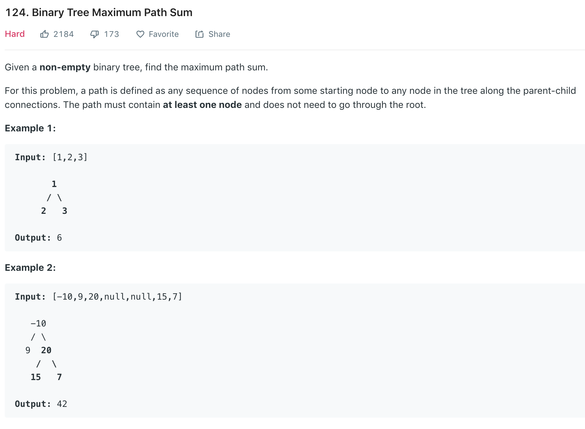

### Solution
```python
class Solution(object):
    def maxPathSum(self, root):
        """
        :type root: TreeNode
        :rtype: int
        """
        self.res = -float('inf')
        self.helper(root)
        return self.res
        
    def helper(self, node):
        if not node: return 0
        
        left = max(self.helper(node.left), 0)
        right = max(self.helper(node.right), 0)
        
        # consider current node as root
        self.res = max(self.res, left+node.val+right)
        
        #only return path with current node and left OR right child
        return node.val+max(left, right)
```