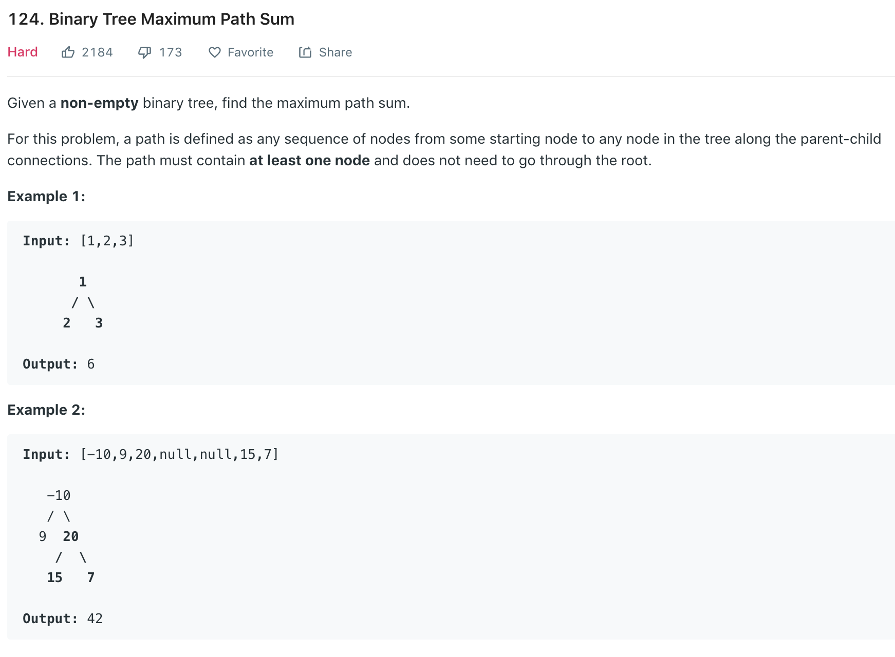

# Binary Tree Maximum Path Sum

### Solution
Similar to **543 Diameter of Tree**
```python
class Solution(object):
    def maxPathSum(self, root):
        """
        :type root: TreeNode
        :rtype: int
        """
        self.res = -float('inf') # or root.val
        self.helper(root)
        return self.res
        
    # return maxPathSum with node as root, also only left OR right child (similar to node height)
    def helper(self, node):
        if not node: return 0
        
        left = max(self.helper(node.left), 0)
        right = max(self.helper(node.right), 0)
        
        # consider current node as root (similar to diameter)
        self.res = max(self.res, left+node.val+right)
        
        #only return path with current node and left OR right child
        return node.val+max(left, right)
```

Neetcode
In the maximum path sum problem, a path can start and end anywhere in the tree, but it must go downward at each step (parent → child).

For every node, two values matter:
1. Max Downward Path starting at this node
* This path can only go to one side (left or right).
* Used by the parent to extend the path upward.
* Computed as: `node.val + max(leftDown, rightDown)`
2. Max Path Through This Node
* This can include both left and right downward paths: `node.val + leftDown + rightDown`
* This may form the global maximum path.

While computing DFS:
* If a downward path sum is negative, we drop it (take 0), because adding negative values only makes the path worse.
* At each node, update the global maximum using the "path through this node".
Return the best downward path to the parent.
This ensures each node is visited once — O(n) optimal time.

Algorithm
1. Maintain a global result res, initialized with the root’s value.
2. Define dfs(node):
* If node is None, return 0.
* Recursively compute:
`leftMax = dfs(node.left)`
`rightMax = dfs(node.right)`
* Ignore negative downward paths:
`leftMax = max(leftMax, 0)`
`rightMax = max(rightMax, 0)`
* Update global result with the best path through node:
`res = max(res, node.val + leftMax + rightMax)`
* Return the best "extendable" downward path:
`node.val + max(leftMax, rightMax)`
3. Call dfs(root) and return res.
```python
class Solution:
    def maxPathSum(self, root: Optional[TreeNode]) -> int:
        res = [root.val]

        def dfs(root):
            if not root:
                return 0

            leftMax = dfs(root.left)
            rightMax = dfs(root.right)
            leftMax = max(leftMax, 0)
            rightMax = max(rightMax, 0)

            res[0] = max(res[0], root.val + leftMax + rightMax)
            return root.val + max(leftMax, rightMax)

        dfs(root)
        return res[0]
```

变形：
若path不能分叉（只能从一个node一路向下）时求最大路径和
1. top-down: 求每个node作为end of path能得到的最大路径和（i.e., maxSum = node.val + max(0, maxSum of parent node)
2. bottom-up: 以leaf node作为递归/dfs的退出条件，i.e., 记录每个node作为start of path能得到的最大路径和（maxSum = node.val + max(0, maxSum(node.left), maxSum(node.right))

类似求高度/balanced binary tree:
* 从上往下数 - dfs(curHeight, node), root为0/1， leaf深度最大
  不适合判断balanced tree
* 从下往上数 - 当遇到None时返回0/leafnode时返回1， for current node, return 1 + max(dfs(node.left), dfs(node.right))