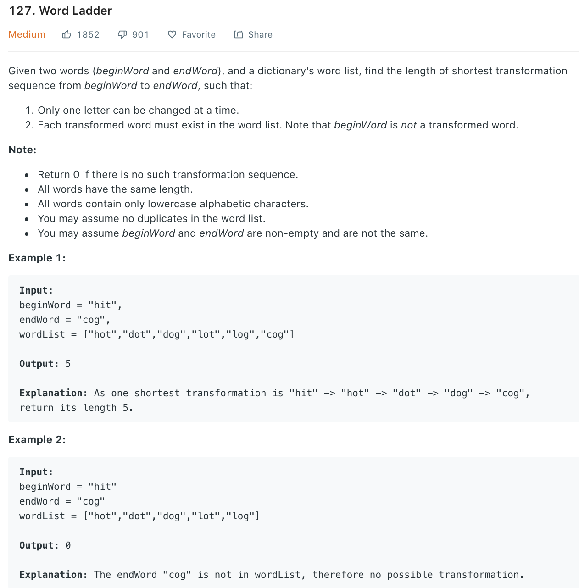

### Solution
```python
class Solution(object):
    def ladderLength(self, beginWord, endWord, wordList):
        """
        :type beginWord: str
        :type endWord: str
        :type wordList: List[str]
        :rtype: int
        """
        def construct_dict(word_list):
            d = {}
            for word in word_list:
                for i in range(len(word)):
                    s = word[:i] + "_" + word[i + 1:]
                    d[s] = d.get(s, []) + [word]
            return d

        def bfs_words(begin, end, dict_words):
            queue, visited = [(begin, 1)], set()
            while queue:
                word, steps = queue.pop(0)
                if word not in visited:
                    visited.add(word)
                    if word == end:
                        return steps
                    for i in range(len(word)):
                        s = word[:i] + "_" + word[i + 1:]
                        neigh_words = dict_words.get(s, [])
                        for neigh in neigh_words:
                            if neigh not in visited:
                                queue.append((neigh, steps + 1))
            return 0

        # d = construct_dict(wordList | set([beginWord, endWord]))
        d = construct_dict(wordList + [beginWord, endWord])
        return bfs_words(beginWord, endWord, d)

    def ladderLength2(self, beginWord, endWord, wordList):
        wordList = set(wordList)
        queue = collections.deque([[beginWord, 1]])
        while queue:
            word, length = queue.popleft()
            if word == endWord:
                return length
            for i in range(len(word)):
                for c in 'abcdefghijklmnopqrstuvwxyz':
                    next_word = word[:i] + c + word[i+1:]
                    if next_word in wordList:
                        wordList.remove(next_word)
                        queue.append([next_word, length + 1])
        return 0
```