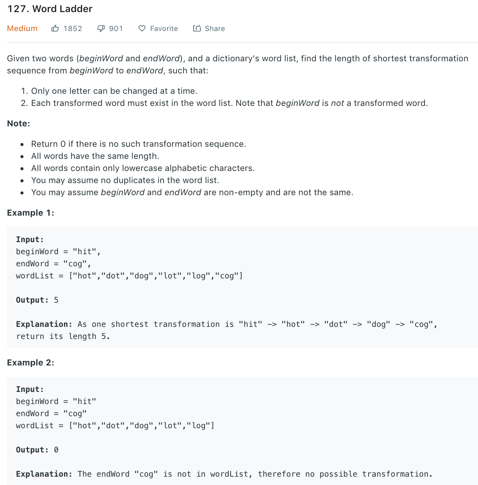

### Solution BFS
```python
class Solution(object):
    def ladderLength(self, beginWord, endWord, wordList):
        """
        :type beginWord: str
        :type endWord: str
        :type wordList: List[str]
        :rtype: int
        """
        def construct_dict(word_list):
            d = {}
            for word in word_list:
                for i in range(len(word)):
                    s = word[:i] + "_" + word[i + 1:]
                    d[s] = d.get(s, []) + [word]
            return d

        def bfs_words(begin, end, dict_words):
            queue, visited = [(begin, 1)], set()
            while queue:
                word, steps = queue.pop(0)
                if word not in visited:
                    visited.add(word)
                    if word == end:
                        return steps
                    for i in range(len(word)):
                        s = word[:i] + "_" + word[i + 1:]
                        neigh_words = dict_words.get(s, [])
                        for neigh in neigh_words:
                            if neigh not in visited:
                                queue.append((neigh, steps + 1))
            return 0

        # d = construct_dict(wordList | set([beginWord, endWord]))
        d = construct_dict(wordList + [beginWord, endWord])
        return bfs_words(beginWord, endWord, d)

    def ladderLength2(self, beginWord, endWord, wordList):
        wordList = set(wordList)
        queue = collections.deque([[beginWord, 1]])
        while queue:
            word, length = queue.popleft()
            if word == endWord:
                return length
            for i in range(len(word)):
                for c in 'abcdefghijklmnopqrstuvwxyz':
                    next_word = word[:i] + c + word[i+1:]
                    if next_word in wordList:
                        wordList.remove(next_word)
                        queue.append([next_word, length + 1])
        return 0
```
or
```python
class Solution:
    def ladderLength(self, beginWord: str, endWord: str, wordList: List[str]) -> int:
        q = [beginWord]
        visited = {beginWord}
        cnt = 0
        while q:
            cnt += 1
            for _ in range(len(q)):
                word = q.pop(0)
                if self.wordDiff(word, endWord) == 0:
                    return cnt
                for nbr in wordList:
                    if nbr not in visited:
                        diff = self.wordDiff(word, nbr)
                        if diff == 0:
                            return cnt + 1
                        if diff == 1:
                            visited.add(nbr)
                            q.append(nbr)
        return 0

    def wordDiff(self, word1, word2):
        if len(word1) != len(word2):
            return -1
        cnt = 0
        for i in range(len(word1)):
            if word1[i] != word2[i]:
                cnt += 1
                if cnt > 1:
                    return cnt
        return cnt
```

neetcode
```python
class Solution:
    def ladderLength(self, beginWord: str, endWord: str, wordList: List[str]) -> int:
        if (endWord not in wordList) or (beginWord == endWord):
            return 0
        words, res = set(wordList), 0
        q = deque([beginWord])
        while q:
            res += 1
            for _ in range(len(q)):
                node = q.popleft()
                if node == endWord:
                    return res
                for i in range(len(node)):
                    for c in range(97, 123):
                        if chr(c) == node[i]:
                            continue
                        # instead of finding neighbor in given wordList
                        # generate neighbor and see if it exists in word set
                        nei = node[:i] + chr(c) + node[i + 1:]
                        if nei in words:
                            q.append(nei)
                            words.remove(nei)
        return 0
```