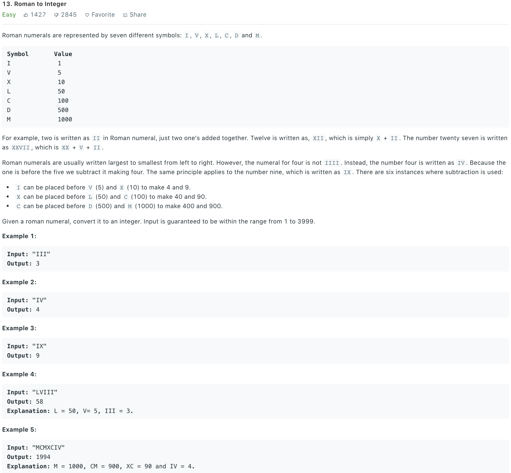

### Solution
```python
class Solution(object):
    def romanToInt(self, s):
        """
        :type s: str
        :rtype: int
        """
        symbols = {"I": 1, "V": 5, "X": 10, "L": 50, "C":100, "D": 500, "M": 1000, "IV": 4, "IX": 9, "XL": 40, "XC": 90, "CD": 400, "CM": 900}
        i, ans = 0, 0
        
        while i < len(s):
            if i < len(s) - 1 and s[i:i + 2] in symbols:
                ans += symbols[s[i:i+2]]
                i += 2
            else:
                ans += symbols[s[i:i+1]]
                i += 1
        
        return ans
```
OR
```python
def romanToInt(self, s):
    roman = {'M': 1000, 'D': 500, 'C': 100, 'L': 50, 'X': 10, 'V': 5, 'I': 1}
    z = 0
    for i in range(0, len(s) - 1):
        if roman[s[i]] < roman[s[i + 1]]:
            z -= roman[s[i]]
        else:
            z += roman[s[i]]
    return z + roman[s[-1]]
```