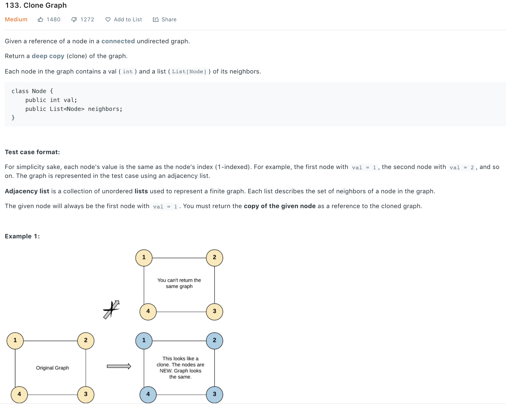

### Solution 1 Hash + dfs
```python
"""
# Definition for a Node.
class Node(object):
    def __init__(self, val = 0, neighbors = None):
        self.val = val
        self.neighbors = neighbors if neighbors is not None else []
"""
我们用一个哈希表g记录原图中的每个节点和它的拷贝节点之间的对应关系，然后进行深度优先搜索。
我们定义函数dfs(node)它的功能是返回node节点的拷贝节点。过程如下：

如果node是null那么dfs(node)的返回值是null;
如果node在g中，那么dfs(node)的返回值是g[node], 否则我们创建一个新的节点cloned, 并将g[node]的值设为cloned.然后遍历 
node的所有邻居节点nxt, 并将cloned的邻居节点列表中加入dfs(nxt)最后返回cloned.
在主函数中，我们返回dfs(node)

class Solution(object):
    def cloneGraph(self, node):
        """
        :type node: Node
        :rtype: Node
        """   
        def helper(node, lookup):
            if not node: return None
        
            if node.val in lookup: return lookup[node.val]
            
            copy = Node(node.val)
            # mark as visited, must do this first (in case node points to itself)
            lookup[copy.val] = copy
            for nbr in node.neighbors:
                copy.neighbors.append(helper(nbr, lookup))
            # lookup[copy.val] = copy
            return copy
        return helper(node, dict())
```

### Solution 2 BFS
```python
class Solution(object):
    def cloneGraph(self, node):
        if not node: return None
        
        mp = dict()
        copy = Node(node.val)
        mp[copy.val] = copy
        
        queue = [node]
        while queue:
            cur = queue.pop(0)
            for nbr in cur.neighbors:
                if nbr.val not in mp:
                    n = Node(nbr.val)
                    mp[nbr.val] = n
                    # ensure not revisiting    
                    # queue.append(n)
                    queue.append(nbr)
                
                mp[cur.val].neighbors.append(mp[nbr.val])
        
        return mp[node.val]
```