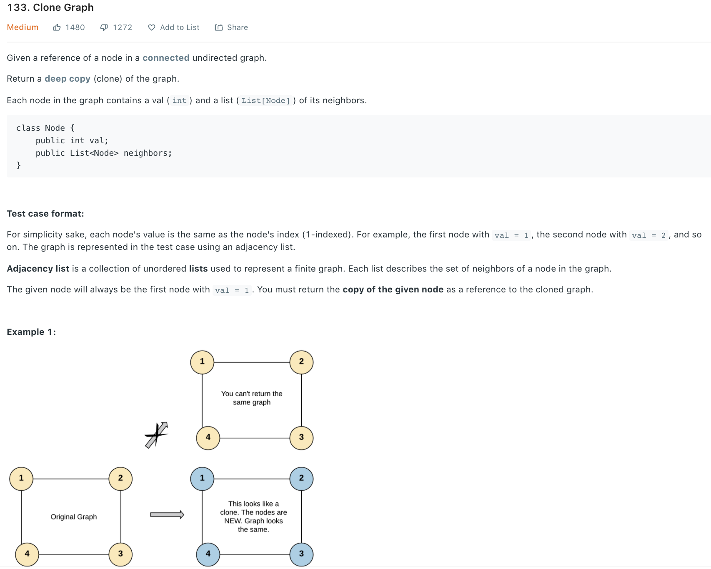

### Solution 1 dfs
```python
"""
# Definition for a Node.
class Node(object):
    def __init__(self, val = 0, neighbors = None):
        self.val = val
        self.neighbors = neighbors if neighbors is not None else []
"""

class Solution(object):
    def cloneGraph(self, node):
        """
        :type node: Node
        :rtype: Node
        """   
        def helper(node, lookup):
            if not node: return None
        
            if node.val in lookup: return lookup[node.val]
            
            copy = Node(node.val)
            lookup[copy.val] = copy
            for nbr in node.neighbors:
                copy.neighbors.append(helper(nbr, lookup))
            # lookup[copy.val] = copy
            return copy
        return helper(node, dict())
```

### Solution 2 BFS
```python
class Solution(object):
    def cloneGraph(self, node):
        if not node: return None
        
        map = dict()
        copy = Node(node.val)
        map[copy.val] = copy
        
        queue = [node]
        while queue:
            cur = queue.pop(0)
            for nbr in cur.neighbors:
                if nbr.val not in map:
                    n = Node(nbr.val)
                    map[nbr.val] = n
                    # ensure not revisiting    
                    # queue.append(n)
                    queue.append(nbr)
                
                map[cur.val].neighbors.append(map[nbr.val])
        
        return map[node.val]
```