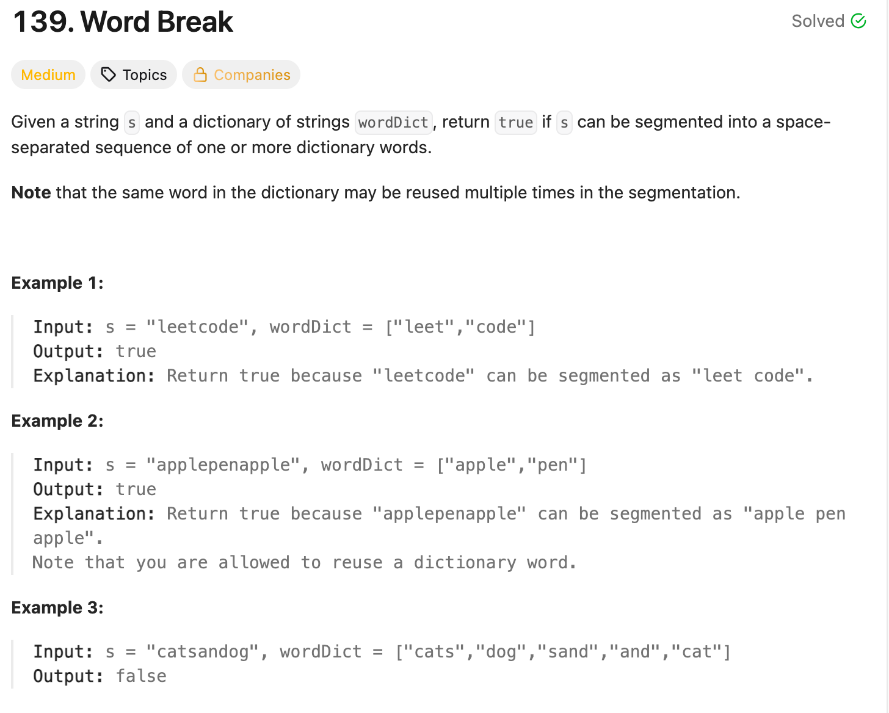

# Word Break

### Solution 1 recursion
TLE
```python
class Solution:
    def wordBreak(self, s: str, wordDict: List[str]) -> bool:
        if not s: return True
        for word in wordDict:
            if s[:len(word)] == word:
                if self.wordBreak(s[len(word):], wordDict):
                    return True
        return False
```
### Solution 2 DP
```python
class Solution:
    def wordBreak(self, s, wordDict):
        """
        :type s: str
        :type wordDict: List[str]
        :rtype: bool
        """
        #        boolean dp[i] represents if s[:i+1] can be made up of wordDict
        dp = [False for i in range(len(s))]

        for i in range(len(dp)):
            for j in range(i + 1):
                # check i 次
                if s[j:i + 1] in wordDict and (j == 0 or dp[j-1]):
                    dp[i] = True
                    break

        return dp[-1]
```
or
```python
def wordBreak(self, s: str, wordDict: List[str]) -> bool:
    n = len(s)
    # dp[i] -> s[:i] can be segmented
    dp = [False] * (n + 1)
    dp[0] = True
    for i in range(1, n+1):
        for j in range(i):
            if s[j:i] in wordDict and dp[j]:
                dp[i] = True
                break
    return dp[-1]
```
or 
```python
class Solution:
    def wordBreak(self, s: str, wordDict: List[str]) -> bool:
        n = len(s)
        # dp[i]: s[:i+1] can be segmented
        dp = [True] + [False] * n
        for i in range(1, n+1):
            # check number of word times
            for w in wordDict:
                if i-len(w) >= 0 and s[i-len(w):i]==w and dp[i-len(w)]:
                    dp[i] = True
                    break
        return dp[-1]
```