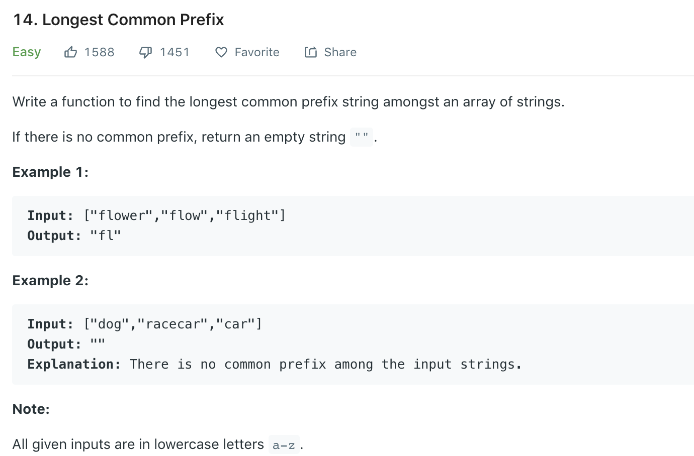

### Solution
```python
class Solution(object):
    # compare all words digit by digit vertically - append
    def longestCommonPrefix(self, strs):
        """
        :type strs: List[str]
        :rtype: str
        """
        res = ""
        # OR
        # n = min(map(len, strs))
        # for i in range(n):
        for i in range(len(strs[0])):
            c = strs[0][i]

            for str in strs:
                if i >= len(str) or str[i] != c:
                    return res
            res += c

        return res
```
Similarly
```python
# use first word as base, compare with second word and get longest common prefix, then compare the result with the 3rd word etc.
def longestCommonPrefix(self, strs):
    if not strs: return ""
    
    base = strs[0]
    max_len = len(base)
    
    for str in strs[1:]:
        j = 0
        while j < len(str) and j < max_len:
            if base[j] == str[j]:
                j += 1
            else:
                max_len = j
                break
        if j == len(str):
            max_len = min(max_len, j)
            
    return base[:max_len]
```