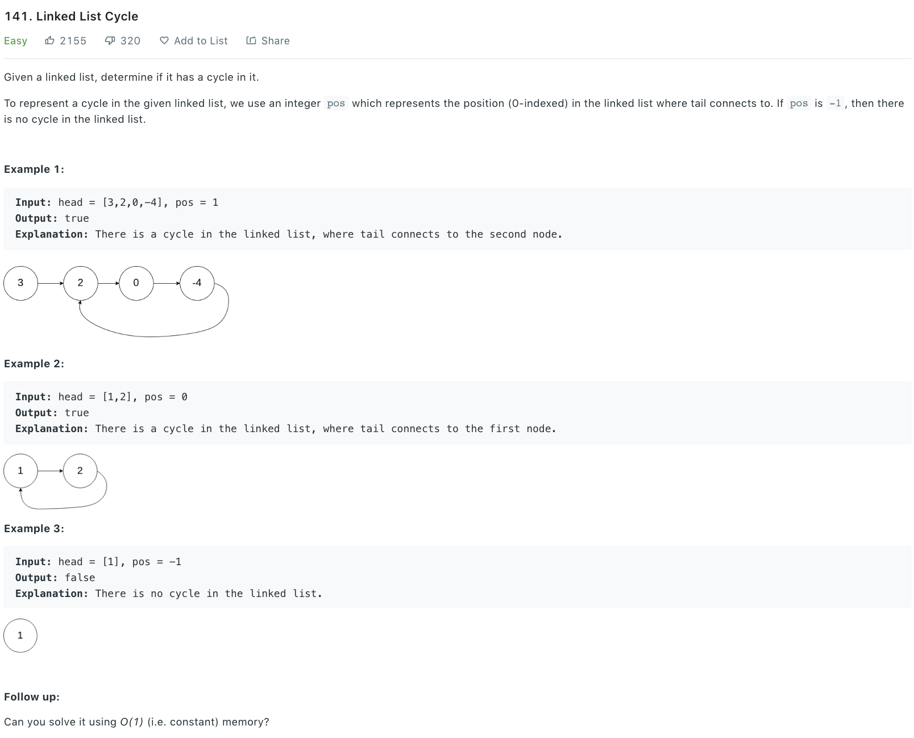

### Solution 1 - fast and slow pointer
```python
def hasCycle(head):
    """
    :type head: ListNode
    :rtype: bool
    """
    if not head:
        return False
    
    fast = head
    slow = head
    
    while fast.next and fast.next.next:
        slow = slow.next
        fast = fast.next.next
        if slow == fast:
            return True
        
    return False
```

### Solution 2  - HashMap
```python
def hasCycle(head: Optional[ListNode]) -> bool:
    seen = set()
    while head:
        if head in seen:
            return True
        seen.add(head)
        head = head.next
    return False
```