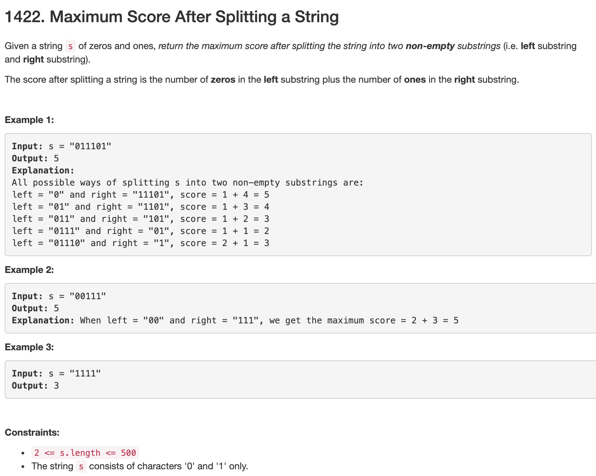

```python
class Solution(object):
    def maxScore(self, s):
        """
        :type s: str
        :rtype: int
        """
        n = len(s)
        left_zero, right_one = [0]*(n-1), [0]*(n-1)
        res = 0
        
        for i in range(n-1):
            if i > 0:
                left_zero[i] = left_zero[i-1]
            if s[i] == '0':
                left_zero[i] += 1
        
        for j in reversed(range(n-1)):
            if j < n-2:
                right_one[j] = right_one[j+1]
            if s[j+1] == '1':
                right_one[j] += 1
        
        for i in range(n-1):
            res = max(left_zero[i]+right_one[i], res)
        
        return res
```
+ time complexity: O(n)
+ space complexity: O(n)