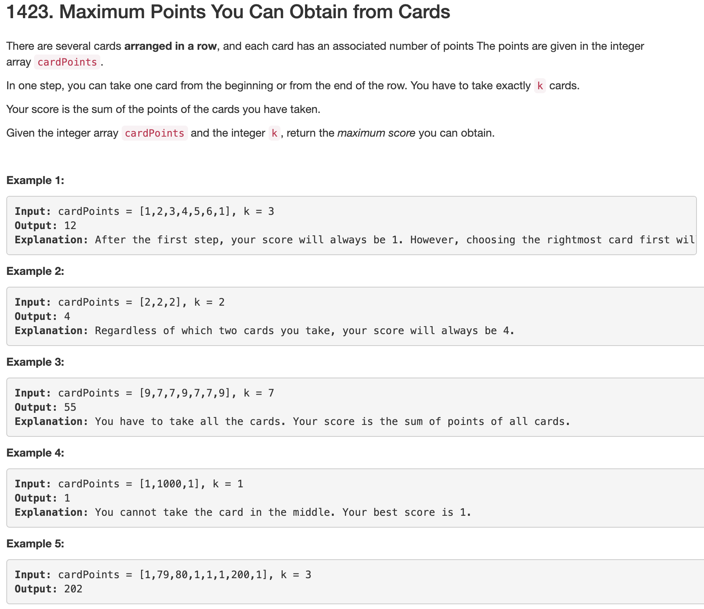

### Soltution 1 TLE
```python
class Solution(object):
    def maxScore(self, cardPoints, k):
        """
        :type cardPoints: List[int]
        :type k: int
        :rtype: int
        """

        def helper(A, l, r, k):
            if k == 0: return 0
            if k == 1: return max(A[l], A[r - 1])
            # select the bigger one from either left side or right side
            return max(A[l] + helper(A, l + 1, r, k - 1), A[r - 1] + helper(A, l, r - 1, k - 1))

        return helper(cardPoints, 0, len(cardPoints), k)
```

### Solution 2 TLE
we have `i` cards on the left and `k-i` cards on the right, just traverse all possible conditions.
```python
    def maxScore2(self, cardPoints, k):
        n = len(cardPoints)
        res = 0
        for i in range(k+1):
            res = max(res, sum(cardPoints[:i])+sum(cardPoints[n-(k-i):]))
        return res
```
+ time complexity: O(k^2)
  
### Solution 3
Based on sol2, but sol2 takes a lot of redundant work to calculate the sum every iteration. So we maintain a window.
```python
        n = len(cardPoints)
        cur = sum(cardPoints[:k])
        res = cur
        l, r = k-1, n-1
        for _ in range(k):
            # remove one element from the end of the left, add one to the head of the right
            cur = cur - cardPoints[l] + cardPoints[r]
            l -= 1
            r -= 1
            res = max(res, cur)

        return res
```
+ time complexity: O(k)
+ space complexity: O(1)