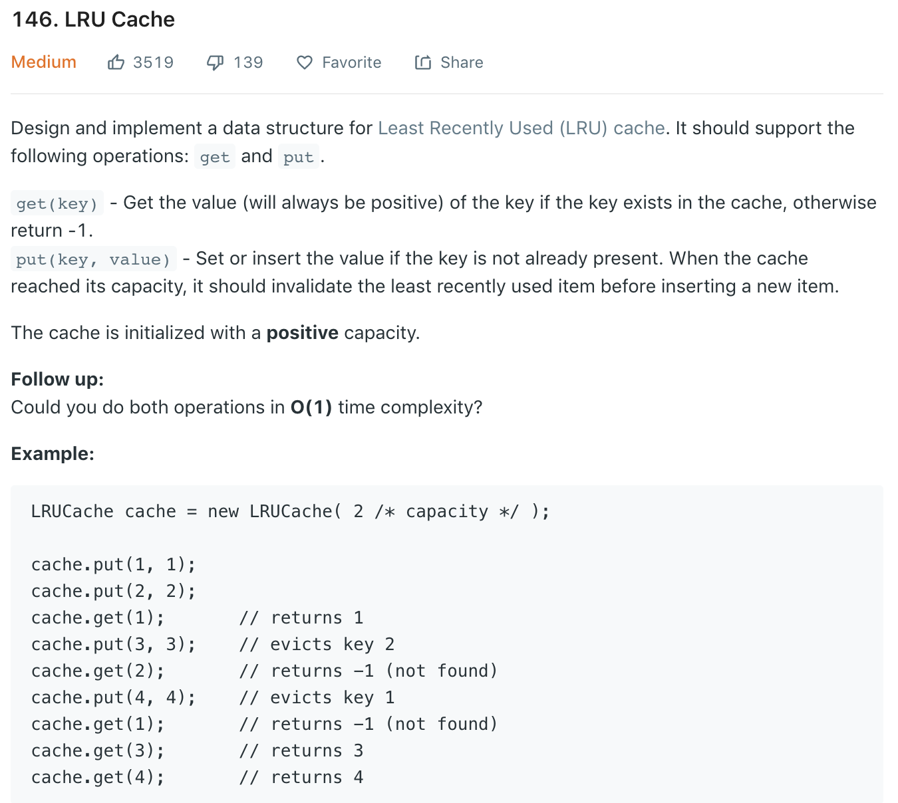

### Solution
Doubly Linked List + HashMap.
```java
import java.util.HashMap;

public class LRUCache {
    class Entry {
        int key;
        int val;
        Entry after;
        Entry before;
        public Entry(int key, int value) {
            this.key = key;
            this.val = value;
        }

        public Entry() {
            this(0, 0);
        }
    }

    private HashMap<Integer, Entry> map;
    int capacity, size;
    private Entry head, tail;

    public LRUCache(int cap) {
        map = new HashMap<>();
        capacity = cap;
        head = new Entry();
        tail = new Entry();
        head.after = tail;
        tail.before = head;
    }

    public int get(int key) {
       Entry node = map.get(key);
       if (node == null) {
           return -1;
       }
       updateEntry(node);
       return node.val;
    }

    public void put(int key, int value) {
        Entry node = map.get(key);
        if (node == null) {
            Entry newNode = new Entry(key, value);
            map.put(key, newNode);
            addEntry(newNode);
            size++;
        } else {
            node.val = value;
            updateEntry(node);
        }
        if (size > capacity) {
            Entry toDel = tail.before;
            deleteEntry(toDel);
            map.remove(toDel.key);
            size--;
        }
    }

    public void updateEntry(Entry node) {
        deleteEntry(node);
        addEntry(node);
    }

//    add node to front (most recently used)
    public void addEntry(Entry node) {
        node.before = head;
        node.after = head.after;
        head.after = node;
        node.after.before = node;

    }

//    remove node from rear (least recently used)
    public void deleteEntry(Entry node) {
        node.before.after = node.after;
        node.after.before = node.before;
    }

}

```
```python
class LRUCache(object):

    class Entry:
        def __init__(self, key, value):
            self.key = key
            self.value = value
            self.after = None
            self.before = None

    def __init__(self, capacity):
        """
        :type capacity: int
        """
        self.map = dict()
        self.size = 0
        self.capacity = capacity
        self.head = self.Entry(0, 0)
        self.tail = self.Entry(0, 0)
        self.head.after = self.tail
        self.tail.before = self.head


    def get(self, key):
        """
        :type key: int
        :rtype: int
        """
        node = self.map.get(key, None)
        if node == None:
            return -1

        self.updateEntry(node)
        return node.value

    def put(self, key, value):
        """
        :type key: int
        :type value: int
        :rtype: None
        """
        node = self.map.get(key, None)

        if node == None:
            self.size += 1
            entry = self.Entry(key, value)
            self.map[key] = entry
            self.addEntry(entry)
        else:
            node.value = value
            self.updateEntry(node)

        if self.size > self.capacity:
            self.size -= 1
            toDel = self.tail.before
            self.deleteEntry(toDel)
            self.map.pop(toDel.key)

    def updateEntry(self, entry):
        self.deleteEntry(entry)
        self.addEntry(entry)

    def deleteEntry(self, entry):
        prev, next = entry.before, entry.after
        prev.after = next
        next.before = prev

    def addEntry(self, entry):
        entry.before = self.head
        entry.after = self.head.after
        self.head.after.before = entry
        self.head.after = entry
```