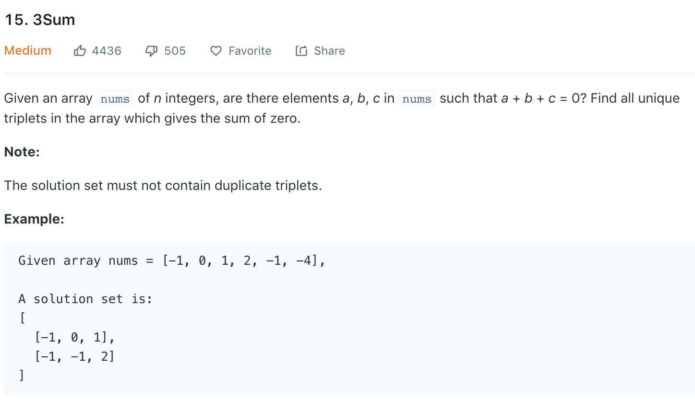

### Solution 1 DFS TLE
```python
class Solution(object):
    def threeSum(self, nums):
        """
        :type nums: List[int]
        :rtype: List[List[int]]
        """
        nums.sort()
        res = []
        
        self.dfs(nums, 0, [], res, 0)
        return res
    
    def dfs(self, nums, start, path, res, sum):
        if len(path) == 3:
            if sum == 0:
                res.append(path)
            return
        
        for i in range(start, len(nums)):
            if sum + nums[i] > 0:
                break
            if i > start and nums[i] == nums[i - 1]:
                continue
            self.dfs(nums, i + 1, path + [nums[i]], res, sum + nums[i])
```
### Solution 2
```python
class Solution(object):
    def threeSum(self, nums):
        """
        :type nums: List[int]
        :rtype: List[List[int]]
        """
        nums.sort()
        res, n = [], len(nums)
        
        for i in range(n - 2):
            if nums[i] > 0: break
            
            if i > 0 and nums[i] == nums[i - 1]:
                continue
            
            l, r = i + 1, n - 1
            while l < r:
                val = nums[l] + nums[r]
                if val == -nums[i]:
                    res.append([nums[i], nums[l], nums[r]])
                    l += 1
                    while l < r and nums[l] == nums[l - 1]:
                        l += 1
                    r -= 1
                    while r > l and nums[r] == nums[r + 1]:
                        r -= 1
                elif val < -nums[i]:
                    l += 1
                else:
                    r -= 1
        
        return res
```
Slightly faster
```python
    def threeSum(self, nums):
        res = []
        nums = sorted(nums)

        for i in range(len(nums)-2):
            if nums[i] > 0: return res
            # avoid duplicates
            if i > 0 and nums[i] == nums[i - 1]: continue

            # 2 sum
            l = i + 1
            r = len(nums) - 1
            while l < r:
                curSum = nums[i] + nums[l] + nums[r]
                if curSum > 0:
                    r -= 1
                elif curSum < 0:
                    l += 1
                else:
                    res.append([nums[i], nums[l], nums[r]])
                    while nums[l+1] == nums[l]:
                        l += 1
                        if l >= len(nums) - 1: break
                    while nums[r-1] == nums[r]:
                        r -= 1
                        if r <= i: break
                    l += 1
                    r -= 1
        return res
```