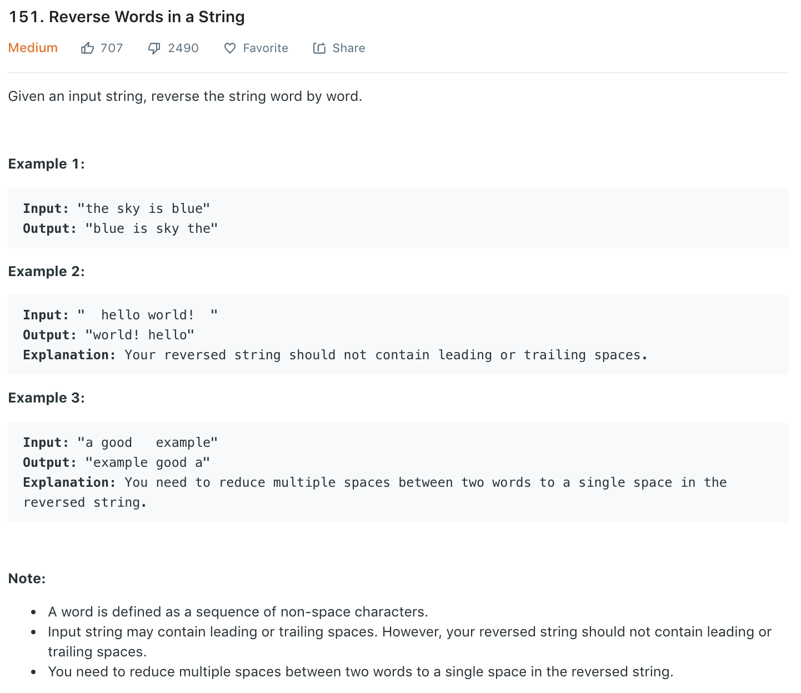

### Solution 1
1-line in python
```python
class Solution(object):
    def reverseWords(self, s):
        """
        :type s: str
        :rtype: str
        """
        return ' '.join(reversed(s.split()))
```

### Solution 2
```python
def reverseWords(s):
    stack = []
    tmp = ''
    s += ' '

    for i in range(len(s)):
        if s[i] == ' ':
            if tmp:
                stack.append(tmp)
                tmp = ''
        else:
            tmp += s[i]

    if not stack:
        return ""

    # res = stack.pop()
    # while stack:
    #     res += " "
    #     res += stack.pop()
    #
    # return res
    return ' '.join(stack[::-1])
```

### Solution 3
```python
def reverseWords(s):
    if not s: return s
    startIdx = 0
    stri = list(s)
    reverse(stri, 0, len(stri) - 1)

    # for i in range(len(stri)):
    i = 0
    while i < len(stri):
        if stri[i] != ' ':
            if startIdx != 0:
                stri[startIdx] = ' '
                startIdx += 1
            j = i
            while j < len(stri) and stri[j] != ' ':
                stri[startIdx] = stri[j]
                startIdx += 1
                j += 1
            self.reverse(stri, startIdx - (j - i), startIdx - 1)

            i = j
        i += 1
    return ''.join(stri[:startIdx])

def reverse(s, i, j):
    while i < j:
        s[i], s[j] = s[j], s[i]
        i += 1
        j -= 1
```