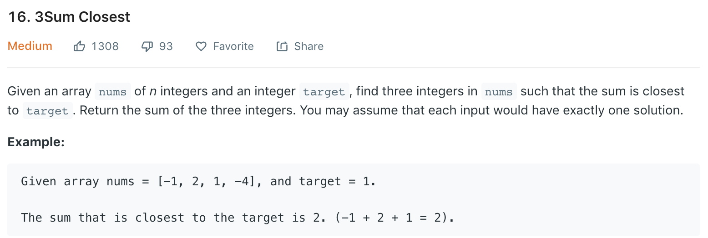

### Solution 1 TLE
Use 3 for-loops.
```python
class Solution(object):
    def threeSumClosest(self, nums, target):
        if len(nums) < 3: return None
        
        nums.sort()
        closest = nums[0] + nums[1] + nums[2]
        for i in range(len(nums) - 2):
            for j in range(i+1, len(nums)-1):
                for k in range(j + 1, len(nums)):
                    val = nums[i] + nums[j] + nums[k]
                    if abs(val - target) < abs(closest - target):
                        closest = val
                    if val > target:
                        break
        
        return closest
```
+ Time complexity: O(n^3)
### Solution 2
```python
class Solution(object):
    def threeSumClosest(self, nums, target):
        """
        :type nums: List[int]
        :type target: int
        :rtype: int
        """
        if not nums or len(nums) < 3: return None
        
        nums.sort()
        closest = nums[0] + nums[1] + nums[2]
        
        for i in range(len(nums) - 2):
            l, r = i + 1, len(nums) - 1
            while l < r:
                val = nums[i] + nums[l] + nums[r]
                if abs(val - target) < abs(closest - target):
                    closest = val
                
                if val > target: r -= 1
                elif val < target: l += 1
                else: return target
        
        return closest
```
+ Time complexity: O(n^2)