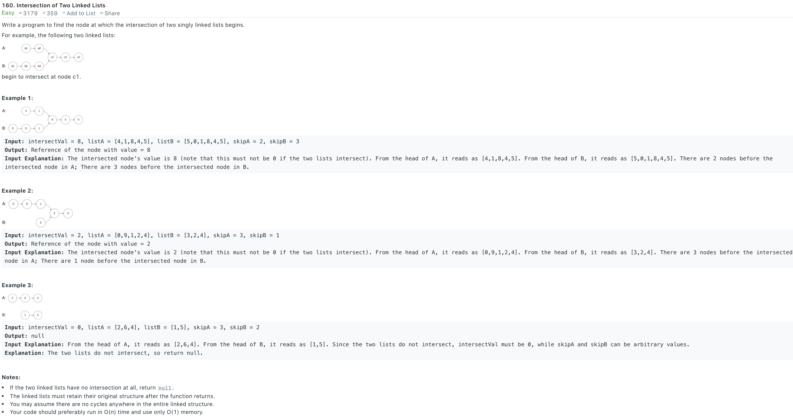

### Solution 1
first iterate through listA, store each node in hashSet, then iterate through listB, check if each node in B is in A by checking hashSet.
+ time complexity: O(n)
+ space complexity: O(n)
### Solution 2
```python
class Solution(object):
    def getIntersectionNode(self, headA, headB):
        """
        :type head1, head1: ListNode
        :rtype: ListNode
        """
        n1, n2 = self.getSize(headA), self.getSize(headB)
        if n1 > n2:
            n1, n2 = n2, n1
            headA, headB = headB, headA
        for _ in range(n2 - n1):
            headB = headB.next
        
        while headA != headB:
            headA = headA.next
            headB = headB.next
        
        return headA
        
    def getSize(self, head):
        size = 0
        while head:
            head = head.next
            size += 1
        
        return size
```
+ time complexity: O(n)
+ space complexity: O(1)